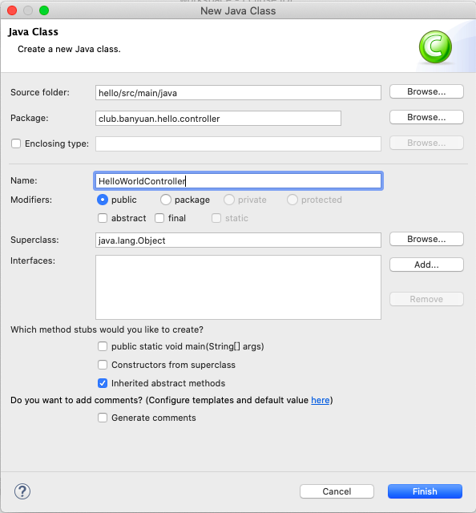
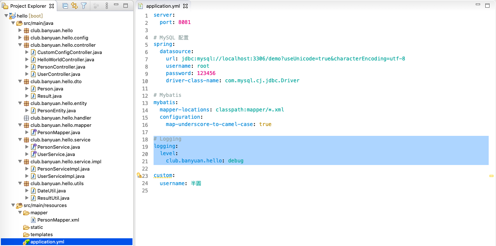

# 从 Hello World 开始搭建基础项目

## 新建一个 Hello World 项目

File -> New -> Project...


选择 Spring Starter Project <br/>
点击 Next <br/>


Name 填入项目名 `hello` <br/>
Group 填入 `club.banyuan` <br/>
Package 填入包名 `club.banyuan.hello` <br/>
点击 Next <br/>


依赖中勾选 Spring Web <br/>
点击 Finish <br/>


等待 Spring Boot 项目构建，完成后项目结构如下 <br/>


## 运行 Hello World

### 新建一个包 `club.banyuan.hello.controller`

在包 `club.banyuan.hello` 右键 <br/>
New -> Package <br/>


Name 输入 `club.banyuan.hello.controller` <br/>
点击 Finish <br/>


### 新建一个 `HelloWorldController`

在包 `club.banyuan.hello.controller` 右键 <br/>
New -> Class <br/>


Name 输入 `HelloWorldController` <br/>
点击 Finish <br/>


文件内容如下 <br/>


```java
package club.banyuan.hello.controller;

import org.springframework.web.bind.annotation.RequestMapping;
import org.springframework.web.bind.annotation.RestController;

@RestController
public class HelloWorldController {

	@RequestMapping("/")
	public String index() {
		return "Hello World!";
	}
}
```

### 运行项目

项目名右键 <br/>
Run As -> Spring Boot App <br/>


项目启动界面如下，等待启动完成 <br/>


在浏览器中输入
```
localhost:8080
```
可以看到浏览器成功显示了 Hello World! <br/>


## 配置端口号

找到项目配置文件 <br/>
配置文件名称 `application.properties` 修改为 `application.yml` <br/>


文件内容如下 <br/>

```
server:
  port: 8081
```

重新启动项目 <br/>
在浏览器中输入 <br/>
```
localhost:8081
```
可以看到端口号成功修改为 8081 <br/>


## 自定义配置

在 `application.yml` 中添加自定义配置信息 <br/>

```
custom:
  username: 半圆
```

按照项目结构 <br/>


新建一个包 `club.banyuan.hello.config` <br/>
新建一个类 `CustomConfig.java` <br/>
内容如下
```java
package club.banyuan.hello.config;

import org.springframework.beans.factory.annotation.Value;
import org.springframework.stereotype.Component;

@Component
public class CustomConfig {

	@Value("${custom.username}")
	private String username;

	public String getUsername() {
		return username;
	}

	public void setUsername(String username) {
		this.username = username;
	}

}
```

在包 `club.banyuan.hello.controller` 新建 `CustomConfigController.java`
内容如下
```java
package club.banyuan.hello.controller;

import org.springframework.beans.factory.annotation.Autowired;
import org.springframework.web.bind.annotation.RequestMapping;
import org.springframework.web.bind.annotation.RestController;

import club.banyuan.hello.config.CustomConfig;

@RestController
public class CustomConfigController {

	@Autowired
	private CustomConfig customConfig;

	@RequestMapping("/custom")
	public String custom() {
		return "读取到自定义配置 custom.username 内容为：" + customConfig.getUsername();
	}
}
```

重新启动项目 <br/>
在浏览器中输入 <br/>
```
localhost:8081/custom
```
可以看到成功读取到自定义配置 <br/>


## 项目结构

### 创建 Package
在 `src/main/java` 下创建 <br/>
club.banyuan.hello.config <br/>
club.banyuan.hello.controller <br/>
club.banyuan.hello.dto <br/>
club.banyuan.hello.entity <br/>
club.banyuan.hello.handler <br/>
club.banyuan.hello.mapper <br/>
club.banyuan.hello.service <br/>
club.banyuan.hello.service.impl <br/>
club.banyuan.hello.utils <br/>

在 `src/main/resources` 下创建 <br/>
mapper <br/>


## 定义接口

写一个 `GET` 方法 `localhost:8081/user/year` 获取当前年份 <br/>
写一个 `POST` 方法 `localhost:8081/user/birth` 参数为 `age` 表示根据年龄获取出生年份 <br/>

在 `club.banyuan.hello.utils` 新建 `DateUtil.java` <br/>
在 `club.banyuan.hello.service` 新建 `UserService.java` <br/>
在 `club.banyuan.hello.service.impl` 新建 `UserServiceImpl.java` <br/>
在 `club.banyuan.hello.controller` 新建 `UserController.java` <br/>

`DateUtil.java` 内容如下
```java
package club.banyuan.hello.utils;

import java.util.Calendar;

public class DateUtil {

	public static int getCurrentYear() {
		Calendar calendar = Calendar.getInstance();
		return calendar.get(Calendar.YEAR);
	}
}
```

`UserService.java` 内容如下
```java
package club.banyuan.hello.service;

public interface UserService {

	public String getCurrentYear();

	public String getBirthYearByAge(int age);
}
```

`UserServiceImpl.java` 内容如下
```java
package club.banyuan.hello.service.impl;

import org.springframework.stereotype.Service;

import club.banyuan.hello.service.UserService;
import club.banyuan.hello.utils.DateUtil;

@Service
public class UserServiceImpl implements UserService {

	@Override
	public String getCurrentYear() {
		int year = DateUtil.getCurrentYear();
		return String.valueOf(year);
	}

	@Override
	public String getBirthYearByAge(int age) {
		int birthYear = DateUtil.getCurrentYear() - age;
		return String.valueOf(birthYear);
	}

}
```

`UserController.java` 内容如下
```java
package club.banyuan.hello.controller;

import org.springframework.beans.factory.annotation.Autowired;
import org.springframework.web.bind.annotation.GetMapping;
import org.springframework.web.bind.annotation.PostMapping;
import org.springframework.web.bind.annotation.RequestMapping;
import org.springframework.web.bind.annotation.RequestParam;
import org.springframework.web.bind.annotation.RestController;

import club.banyuan.hello.service.UserService;

@RestController
@RequestMapping("/user")
public class UserController {

	@Autowired
	private UserService userService;
	
	@GetMapping("/year")
	public String getCurrentYear() {
		return userService.getCurrentYear();
	}
	
	@PostMapping("/birth")
	public String getBirthYearByAge(@RequestParam("age") int age) {
		return userService.getBirthYearByAge(age);
	}
}
```

## 使用 Postman 调用接口

重新启动项目 <br/>
打开 Postman <br/>
选择 `GET` 请求地址输入 `localhost:8081/user/year` <br/>
点击 `Send` <br/>
可以看到下方 `body` 返回了结果 2020 <br/>


选择 `POST` 请求地址输入 `localhost:8081/user/birth` <br/>
在 `Body` 选项卡选择 `x-www-form-urlencoded` <br/>
`KEY` 输入 `age` `VALUE` 输入 `18` <br/>
点击 `Send` <br/>
可以看到下方 `body` 返回了结果 2002 <br/>


## 整合 Mybatis 操作 MySQL

### 创建表
| 字段 | 类型 | 描述 |
| -- | -- | -- |
| id | int | 主键 |
| name | varchar | 姓名 |
| age | int | 年龄 |

```
CREATE DATABASE IF NOT EXISTS demo;
USE demo;
CREATE TABLE `person` (
  `id` int unsigned NOT NULL AUTO_INCREMENT COMMENT '主键',
  `name` varchar(255) DEFAULT NULL COMMENT '姓名',
  `age` int DEFAULT '1' COMMENT '年龄',
  PRIMARY KEY (`id`)
) ENGINE=InnoDB DEFAULT CHARSET=utf8mb4;
```

### 添加数据库依赖

在项目的 `pom.xml` 文件 <br/>


添加依赖 <br/>
```
<dependency>
    <groupId>mysql</groupId>
    <artifactId>mysql-connector-java</artifactId>
</dependency>

<dependency>
    <groupId>org.mybatis.spring.boot</groupId>
    <artifactId>mybatis-spring-boot-starter</artifactId>
    <version>2.0.0</version>
</dependency>
```


### 配置数据库连接

在 `application.yml` 中添加以下配置信息
```
# MySQL 配置
spring:
  datasource:
    url: jdbc:mysql://localhost:3306/demo?useUnicode=true&characterEncoding=utf-8
    username: root
    password: 123456
    driver-class-name: com.mysql.cj.jdbc.Driver

# Mybatis
mybatis:
  mapper-locations: classpath:mapper/*.xml
  configuration:
    map-underscore-to-camel-case: true
```


### 添加 `@MapperScan` 注解

在启动文件 `HelloApplication.java` <br/>


添加 `@MapperScan` 注解

```java
package club.banyuan.hello;

import org.mybatis.spring.annotation.MapperScan;
import org.springframework.boot.SpringApplication;
import org.springframework.boot.autoconfigure.SpringBootApplication;

@SpringBootApplication
@MapperScan("club.banyuan.hello.mapper")
public class HelloApplication {

	public static void main(String[] args) {
		SpringApplication.run(HelloApplication.class, args);
	}

}
```


### 测试数据库连接

简单点就查询一下刚刚新建的表有多少条记录 <br/>
预想结果是 0 条记录 <br/>
这里就测试一下数据库连接 <br/>

在 `club.banyuan.hello.entity` 下新增 `PersonEntity.java`
```java
package club.banyuan.hello.entity;

import java.io.Serializable;

public class PersonEntity implements Serializable {

	/**
	 * 
	 */
	private static final long serialVersionUID = 1L;

	private Integer id;
	private String name;
	private Integer age;
	public Integer getId() {
		return id;
	}
	public void setId(Integer id) {
		this.id = id;
	}
	public String getName() {
		return name;
	}
	public void setName(String name) {
		this.name = name;
	}
	public Integer getAge() {
		return age;
	}
	public void setAge(Integer age) {
		this.age = age;
	}
}
```


在 `club.banyuan.hello.mapper` 下新增 `PersonMapper.java`

```java
package club.banyuan.hello.mapper;

public interface PersonMapper {

	public int total();
}
```


在 `resources/mapper` 下新增 `PersonMapper.xml`
```
<?xml version="1.0" encoding="UTF-8"?>
<!DOCTYPE mapper PUBLIC "-//mybatis.org//DTD Mapper 3.0//EN" "http://mybatis.org/dtd/mybatis-3-mapper.dtd">
<mapper namespace="club.banyuan.hello.mapper.PersonMapper">
	<resultMap id="BaseResultMap" type="club.banyuan.hello.entity.PersonEntity">
		<id column="id" jdbcType="INTEGER" property="id"/>
        <result column="name" jdbcType="VARCHAR" property="name"/>
        <result column="age" jdbcType="INTEGER" property="age"/>
	</resultMap>
	<sql id="Base_Column_List">
		id, name, age
	</sql>
	<select id="total" parameterType="Map" resultType="int">
		select count(*) from person
	</select>
</mapper>
```


在 `club.banyuan.hello.service` 下新增 `PersonService.java`

```java
package club.banyuan.hello.service;

public interface PersonService {

	public int total();
}
```


在 `club.banyuan.hello.service.impl` 下新增 `PersonServiceImpl.java`

```java
package club.banyuan.hello.service.impl;

import org.springframework.beans.factory.annotation.Autowired;
import org.springframework.stereotype.Service;

import club.banyuan.hello.mapper.PersonMapper;
import club.banyuan.hello.service.PersonService;

@Service
public class PersonServiceImpl implements PersonService {

	@Autowired
	private PersonMapper personMapper;

	@Override
	public int total() {
		return personMapper.total();
	}

}
```


在 `club.banyuan.hello.controller` 下新增 `PersonController.java`
```java
package club.banyuan.hello.controller;

import org.springframework.beans.factory.annotation.Autowired;
import org.springframework.web.bind.annotation.GetMapping;
import org.springframework.web.bind.annotation.RequestMapping;
import org.springframework.web.bind.annotation.RestController;

import club.banyuan.hello.service.PersonService;

@RestController
@RequestMapping("/person")
public class PersonController {
	
	@Autowired
	private PersonService personService;
	
	@GetMapping("/total")
	public String total() {
		return "Person 表记录数为：" + personService.total();
	}

}
```


重新启动项目 <br/>
在浏览器中输入 <br/>
```
localhost:8081/person/total
```
可以看到成功读取到数据库表 Person 记录数 <br/>


### MySQL增删改查

在 `club.banyuan.hello.mapper` 下 `PersonMapper.java` 添加定义方法
```java
package club.banyuan.hello.mapper;

import java.util.List;

import club.banyuan.hello.entity.PersonEntity;

public interface PersonMapper {

	public int total();
	
	public PersonEntity getById(Integer id);
	
	public List<PersonEntity> getAll();
	
	public int insert(PersonEntity person);
	
	public int updateById(PersonEntity person);
	
	public int deleteById(Integer id);
}
```


在 `resources/mapper` 下 `PersonMapper.xml` 添加数据库操作
```
<?xml version="1.0" encoding="UTF-8"?>
<!DOCTYPE mapper PUBLIC "-//mybatis.org//DTD Mapper 3.0//EN" "http://mybatis.org/dtd/mybatis-3-mapper.dtd">
<mapper namespace="club.banyuan.hello.mapper.PersonMapper">
	<resultMap id="BaseResultMap" type="club.banyuan.hello.entity.PersonEntity">
		<id column="id" jdbcType="INTEGER" property="id"/>
        <result column="name" jdbcType="VARCHAR" property="name"/>
        <result column="age" jdbcType="INTEGER" property="age"/>
	</resultMap>
	<sql id="Base_Column_List">
		id, name, age
	</sql>
	<select id="total" parameterType="Map" resultType="int">
		select count(*) from person
	</select>
	<select id="getById" parameterType="java.lang.Integer" resultMap="BaseResultMap">
		select <include refid="Base_Column_List"></include> from person where id= #{id}
	</select>
	<select id="getAll" resultMap="BaseResultMap">
		select <include refid="Base_Column_List"></include> from person
	</select>
	<insert id="insert" parameterType="club.banyuan.hello.entity.PersonEntity">
		insert into person(name, age) values(#{name}, #{age})
	</insert>
	<update id="updateById" parameterType="club.banyuan.hello.entity.PersonEntity">
		update person
		<set>
			<if test="name != null">
				name = #{name},
			</if>
			<if test="age != null">
				age = #{age},
			</if>
		</set>
		where id = #{id}
	</update>
	<delete id="deleteById" parameterType="java.lang.Integer">
	    delete from person where id = #{id}
	</delete>
</mapper>
```


在 `club.banyuan.hello.dto` 下新增 `Person.java`
```java
package club.banyuan.hello.dto;

public class Person {

	private Integer id;	
	private String name;
	private Integer age;

	public Integer getId() {
		return id;
	}
	public void setId(Integer id) {
		this.id = id;
	}
	public String getName() {
		return name;
	}
	public void setName(String name) {
		this.name = name;
	}
	public Integer getAge() {
		return age;
	}
	public void setAge(Integer age) {
		this.age = age;
	}
	
}
```


在 `club.banyuan.hello.service` 下 `PersonService.java` 添加方法
```java
package club.banyuan.hello.service;

import java.util.List;

import club.banyuan.hello.dto.Person;

public interface PersonService {

	public int total();
	
	public Person getPersonById(Integer id);
	
	public List<Person> getAllPerson();
	
	public boolean insert(Person person);
	
	public boolean updateById(Person person);
	
	public boolean deleteById(Integer id);
}
```


在 `club.banyuan.hello.service.impl` 下 `PersonServiceImpl.java` 实现方法
```java
package club.banyuan.hello.service.impl;

import java.util.ArrayList;
import java.util.List;

import org.springframework.beans.BeanUtils;
import org.springframework.beans.factory.annotation.Autowired;
import org.springframework.stereotype.Service;
import org.springframework.transaction.annotation.Transactional;

import club.banyuan.hello.dto.Person;
import club.banyuan.hello.entity.PersonEntity;
import club.banyuan.hello.mapper.PersonMapper;
import club.banyuan.hello.service.PersonService;

@Service
public class PersonServiceImpl implements PersonService {

	@Autowired
	private PersonMapper personMapper;

	@Override
	public int total() {
		return personMapper.total();
	}

	@Override
	public Person getPersonById(Integer id) {
		PersonEntity personEntity = personMapper.getById(id);
		Person person = new Person();
		BeanUtils.copyProperties(personEntity, person);
		return person;
	}

	@Override
	public List<Person> getAllPerson() {
		List<PersonEntity> personEntityList = personMapper.getAll();
		List<Person> list = new ArrayList<Person>();
		for (PersonEntity personEntity : personEntityList) {
			Person person = new Person();
			BeanUtils.copyProperties(personEntity, person);
			list.add(person);
		}
		return list;
	}

	@Override
	@Transactional(rollbackFor = Exception.class)
	public boolean insert(Person person) {
		PersonEntity personEntity = new PersonEntity();
		personEntity.setName(person.getName());
		personEntity.setAge(person.getAge());
		return personMapper.insert(personEntity) > 0;
	}

	@Override
	@Transactional(rollbackFor = Exception.class)
	public boolean updateById(Person person) {
		PersonEntity personEntity = personMapper.getById(person.getId());
		if (personEntity != null) {
			if (person.getName() != null) {
				personEntity.setName(person.getName());
			}
			if (person.getAge() != null) {
				personEntity.setAge(person.getAge());
			}
			return personMapper.updateById(personEntity) > 0;
		}
		return false;
	}

	@Override
	@Transactional(rollbackFor = Exception.class)
	public boolean deleteById(Integer id) {
		PersonEntity personEntity = personMapper.getById(id);
		if (personEntity != null) {
			return personMapper.deleteById(id) > 0;
		}
		return false;
	}

}
```

在 `club.banyuan.hello.controller` 下 `PersonController.java` 定义接口
```java
package club.banyuan.hello.controller;

import java.util.List;

import org.springframework.beans.factory.annotation.Autowired;
import org.springframework.web.bind.annotation.GetMapping;
import org.springframework.web.bind.annotation.PostMapping;
import org.springframework.web.bind.annotation.RequestBody;
import org.springframework.web.bind.annotation.RequestMapping;
import org.springframework.web.bind.annotation.RequestParam;
import org.springframework.web.bind.annotation.RestController;

import club.banyuan.hello.dto.Person;
import club.banyuan.hello.service.PersonService;

@RestController
@RequestMapping("/person")
public class PersonController {
	
	@Autowired
	private PersonService personService;
	
	@GetMapping("/total")
	public String total() {
		return "Person 表记录数为：" + personService.total();
	}
	
	@GetMapping("/get")
	public Person getPersonById(@RequestParam("id") Integer id) {
		return personService.getPersonById(id);
	}
	
	@GetMapping("/all")
	public List<Person> getAllPerson() {
		return personService.getAllPerson();
	}
	
	@PostMapping("/add")
	public boolean add(@RequestBody Person person) {
		return personService.insert(person);
	}
	
	@PostMapping("/update")
	public boolean update(@RequestBody Person person) {
		return personService.updateById(person);
	}
	
	@PostMapping("/delete")
	public boolean delete(@RequestParam("id") Integer id) {
		return personService.deleteById(id);
	}
}
```

重新启动项目 <br/>
使用 Postman 进行调用 <br/>

第一步调用新增接口 <br/>
`POST` 方法调用接口
```
localhost:8081/person/add
```
`Body` 选择 `raw` 并指定 `JSON` 格式，入参输入
```
{
    "name": "张三",
    "age": 18
}
```
点击 `Send` 可以看到下方结果返回 `true` <br/>


打开数据库可以查询到刚刚新增的记录 <br/>


第二步调用根据ID查询接口 <br/>
`GET` 方法调用接口
```
localhost:8081/person/get?id=1
```
点击 `Send` 可以看到下方返回结果
```
{
    "id": 1,
    "name": "张三",
    "age": 18
}
```


第三步调用新增接口 <br/>
`POST` 方法调用接口
```
localhost:8081/person/add
```
`Body` 选择 `raw` 并指定 `JSON` 格式，入参输入
```
{
    "name": "李四",
    "age": 19
}
```
点击 `Send` 可以看到下方结果返回 `true` <br/>


第四步调用查询所有 <br/>
`GET` 方法调用接口
```
localhost:8081/person/all
```
点击 `Send` 可以看到下方返回结果
```
[
    {
        "id": 1,
        "name": "张三",
        "age": 18
    },
    {
        "id": 2,
        "name": "李四",
        "age": 19
    }
]
```


第五步调用新增接口 <br/>
`POST` 方法调用接口
```
localhost:8081/person/add
```
`Body` 选择 `raw` 并指定 `JSON` 格式，入参输入
```
{
    "name": "王五",
    "age": 20
}
```
点击 `Send` 可以看到下方结果返回 `true` <br/>


第六步调用修改接口 <br/>
`POST` 方法调用接口
```
localhost:8081/person/update
```
`Body` 选择 `raw` 并指定 `JSON` 格式，入参输入
```
{
    "id": "2",
    "name": "钱六"
}
```


第七步调用查询所有 <br/>
`GET` 方法调用接口
```
localhost:8081/person/all
```
点击 `Send` 可以看到下方返回结果
```
[
    {
        "id": 1,
        "name": "张三",
        "age": 18
    },
    {
        "id": 2,
        "name": "钱六",
        "age": 19
    },
    {
        "id": 3,
        "name": "王五",
        "age": 20
    }
]
```


第八步调用删除接口 <br/>
`POST` 方法调用
```
localhost:8081/person/delete
```
`Body` 选择 `x-www-form-urlencoded`，`KEY` 为 id 且 `VALUE` 为 2
点击 `Send` 可以看到下方结果返回 `true` <br/>


第九步调用查询所有 <br/>
`GET` 方法调用接口
```
localhost:8081/person/all
```
点击 `Send` 可以看到下方返回结果
```
[
    {
        "id": 1,
        "name": "张三",
        "age": 18
    },
    {
        "id": 2,
        "name": "钱六",
        "age": 19
    },
    {
        "id": 3,
        "name": "王五",
        "age": 20
    }
]
```


打开数据库可以查询到最终的记录 <br/>


## 统一响应格式

在 `club.banyuan.hello.dto` 下新增 `Result.java`
```java
package club.banyuan.hello.dto;

public class Result<T> {
	
	private Integer code;
	private String msg;
	private T data;

	public Integer getCode() {
		return code;
	}

	public void setCode(Integer code) {
		this.code = code;
	}

	public String getMsg() {
		return msg;
	}

	public void setMsg(String msg) {
		this.msg = msg;
	}

	public T getData() {
		return data;
	}

	public void setData(T data) {
		this.data = data;
	}

}
```


在 `club.banyuan.hello.utils` 下新增 `ResultUtil.java`
```java
package club.banyuan.hello.utils;

import club.banyuan.hello.dto.Result;

public class ResultUtil {

	public static Result<?> success(Object object) {
		Result<Object> result = new Result<Object>();
		result.setCode(0);
		result.setMsg("成功");
		result.setData(object);
		return result;
	}
	
	public static Result<?> success() {
		return success(null);
	}
	
	public static Result<?> error(Integer code, String message) {
		Result<Object> result = new Result<Object>();
		result.setCode(code);
		result.setMsg(message);
		return result;
	}
}
```


改造统一一下 `PersonController` 的返回格式
```java
package club.banyuan.hello.controller;

import java.util.List;

import org.springframework.beans.factory.annotation.Autowired;
import org.springframework.web.bind.annotation.GetMapping;
import org.springframework.web.bind.annotation.PostMapping;
import org.springframework.web.bind.annotation.RequestBody;
import org.springframework.web.bind.annotation.RequestMapping;
import org.springframework.web.bind.annotation.RequestParam;
import org.springframework.web.bind.annotation.RestController;

import club.banyuan.hello.dto.Person;
import club.banyuan.hello.dto.Result;
import club.banyuan.hello.service.PersonService;
import club.banyuan.hello.utils.ResultUtil;

@RestController
@RequestMapping("/person")
public class PersonController {
	
	@Autowired
	private PersonService personService;
	
	@GetMapping("/total")
	public Result<?> total() {
		String data = "Person 表记录数为：" + personService.total();
		return ResultUtil.success(data);
	}
	
	@GetMapping("/get")
	public Result<?> getPersonById(@RequestParam("id") Integer id) {
		Person data = personService.getPersonById(id); 
		return ResultUtil.success(data);
	}
	
	@GetMapping("/all")
	public Result<?> getAllPerson() {
		List<Person> data = personService.getAllPerson();
		return ResultUtil.success(data);
	}
	
	@PostMapping("/add")
	public Result<?> add(@RequestBody Person person) {
		personService.insert(person);
		return ResultUtil.success();
	}
	
	@PostMapping("/update")
	public Result<?> update(@RequestBody Person person) {
		if (person.getId() == null) {
			return ResultUtil.error(10, "用户ID不能为空");
		}
		boolean result = personService.updateById(person);
		if (!result) {
			return ResultUtil.error(20, "该用户不存在");
		}
		return ResultUtil.success();
	}
	
	@PostMapping("/delete")
	public Result<?> delete(@RequestParam("id") Integer id) {
		boolean result = personService.deleteById(id);
		if (!result) {
			return ResultUtil.error(20, "该用户不存在");
		}
		return ResultUtil.success();
	}
}
```

重新启动项目 <br/>
使用 Postman 进行调用 <br/>

`GET` 方法调用接口
```
localhost:8081/person/all
```
点击 `Send` 可以看到下方返回结果
```
{
    "code": 0,
    "msg": "成功",
    "data": [
        {
            "id": 1,
            "name": "张三",
            "age": 18
        },
        {
            "id": 3,
            "name": "王五",
            "age": 20
        }
    ]
}
```


`POST` 方法调用接口
```
localhost:8081/person/update
```
`Body` 选择 `raw` 并指定 `JSON` 格式，入参输入
```
{
    "id": "1000",
    "name": "不存在"
}
```
点击 `Send` 可以看到下方返回结果
```
{
    "code": 20,
    "msg": "该用户不存在",
    "data": null
}
```


## 代码调试及日志的使用

在 `PersonController.java` 添加日志记录
```
private static final Logger log = LoggerFactory.getLogger(PersonController.class);
	
@Autowired
private PersonService personService;
	
@GetMapping("/total")
public Result<?> total() {
	log.debug("this is debug message");
	log.info("this is info message");
	log.warn("this is warning message");
	log.error("this is error message");

	String data = "Person 表记录数为：" + personService.total();
	return ResultUtil.success(data);
}
```


重新启动项目 <br/>
`GET` 方法调用接口
```
localhost:8081/person/total
```

查看控制台结果，这里显示出了 `info` `warn` `error` 级别的日志，但是没有 `debug` 级别的日志


在配置文件 `application.yml` 指定日志级别
```
# Logging
logging:
  level:
    club.banyuan.hello: debug
```


重新启动项目 <br/>
`GET` 方法调用接口
```
localhost:8081/person/total
```

查看控制台结果，现在 `debug` 级别的日志也显示出来了


在 `PersonController.java` 的 `update` 方法 <br/>
双击行号左侧空白栏打断点 <br/>


右键项目 Debug As -> Spring Boot App <br/>


`POST` 方法调用接口
```
localhost:8081/person/update
```
`Body` 选择 `raw` 并指定 `JSON` 格式，入参输入
```
{
    "name": "张三",
    "age": 20,
    "other": "hello"
}
```


点击 `Send` 之后，程序会运行到断点处 <br/>


鼠标放在 `person` 上会显示出变量信息 <br/>


这个工具栏可以控制断点处程序的执行 <br/>


比如这里我们按 `F6` 程序会往下执行一步 <br/>


按 `F8` 程序会跳过所有断点运行下去，或者按红色的停止程序 <br/>


通过写日志和打断点调试可以方便快速的找到问题所在。

## 异常处理

在项目 `pom.xml` 添加依赖
```
<dependency>
	<groupId>org.springframework.boot</groupId>
	<artifactId>spring-boot-starter-validation</artifactId>
</dependency>
```

在 `club.banyuan.hello.dto` 下 `Person.java` 里成员变量 `name` 上添加一句
```
@NotBlank(message = "姓名不能为空")
```


在 `club.banyuan.hello.controller` 下 `add` 接口添加 `@Valid`
```
@PostMapping("/add")
public Result<?> add(@RequestBody @Valid Person person) {
	personService.insert(person);
	return ResultUtil.success();
}
```


在 `club.banyuan.hello.handler` 下新增 `GlobalExceptionHandler.java`
```java
package club.banyuan.hello.handler;

import org.slf4j.Logger;
import org.slf4j.LoggerFactory;
import org.springframework.validation.FieldError;
import org.springframework.web.bind.MethodArgumentNotValidException;
import org.springframework.web.bind.annotation.ExceptionHandler;
import org.springframework.web.bind.annotation.RestControllerAdvice;

import club.banyuan.hello.dto.Result;
import club.banyuan.hello.utils.ResultUtil;

@RestControllerAdvice
public class GlobalExceptionHandler {

	private static final Logger log = LoggerFactory.getLogger(GlobalExceptionHandler.class);

	@ExceptionHandler(Exception.class)
	public Result<?> handler(Exception e) {
		if (e instanceof MethodArgumentNotValidException) {
			StringBuffer sb = new x();
			for (FieldError error : ((MethodArgumentNotValidException) e).getBindingResult().getFieldErrors()) {
				sb.append(error.getField()).append(":").append(error.getDefaultMessage()).append("\n");
			}
			return ResultUtil.error(-1, sb.toString());
		}
		log.error("系统异常", e);
		return ResultUtil.error(-1, e.getMessage());
	}
}
```


重新启动项目 <br/>
`POST` 方法调用接口
```
localhost:8081/person/add
```
`Body` 选择 `raw` 并指定 `JSON` 格式，入参输入
```
{
    "age": 20
}
```
点击 `Send` 可以看到下方结果<br/>


## Redis使用

### 添加Redis依赖
在项目的 `pom.xml` 文件 <br/>
添加依赖 <br/>
```
<dependency>
    <groupId>org.springframework.boot</groupId>
    <artifactId>spring-boot-starter-data-redis</artifactId>
</dependency>

<dependency>
	<groupId>org.apache.commons</groupId>
	<artifactId>commons-pool2</artifactId>
</dependency>
```


### 配置Redis连接
在 `application.yml` 中添加以下配置信息
```
spring:
  redis:
    database: 0 # 数据库索引 默认0
    host: 127.0.0.1
    port: 6379
    timeout: 30000
    lettuce:
      pool:
        max-idle: 2 # 连接池中的最大空闲连接 默认8
        min-idle: 2 # 连接池中的最小空闲连接 默认0
        max-active: 2 # 连接池最大连接数 默认8 ，负数表示没有限制
        max-wait: -1 # 连接池最大阻塞等待时间（使用负值表示没有限制） 默认-1
```


### 创建RedisConfig类
在 `club.banyuan.hello.config` 下新建 `RedisConfig.java`
```java
package club.banyuan.hello.config;

import org.springframework.context.annotation.Bean;
import org.springframework.context.annotation.Configuration;
import org.springframework.data.redis.connection.lettuce.LettuceConnectionFactory;
import org.springframework.data.redis.core.RedisTemplate;
import org.springframework.data.redis.serializer.Jackson2JsonRedisSerializer;
import org.springframework.data.redis.serializer.StringRedisSerializer;

import com.fasterxml.jackson.annotation.JsonAutoDetect;
import com.fasterxml.jackson.annotation.PropertyAccessor;
import com.fasterxml.jackson.databind.ObjectMapper;

@Configuration
public class RedisConfig {

	@Bean
	public RedisTemplate<String, Object> redisTemplate(LettuceConnectionFactory connectionFactory) {
		RedisTemplate<String, Object> redisTemplate = new RedisTemplate<String, Object>();
		Jackson2JsonRedisSerializer<Object> jacksonSeial = new Jackson2JsonRedisSerializer<>(Object.class);
		ObjectMapper om = new ObjectMapper();
		om.setVisibility(PropertyAccessor.ALL, JsonAutoDetect.Visibility.ANY);
		om.enableDefaultTyping(ObjectMapper.DefaultTyping.NON_FINAL);
		jacksonSeial.setObjectMapper(om);
		
		redisTemplate.setKeySerializer(new StringRedisSerializer());
		redisTemplate.setHashKeySerializer(new StringRedisSerializer());
		redisTemplate.setValueSerializer(jacksonSeial);
		redisTemplate.setHashValueSerializer(jacksonSeial);
		redisTemplate.setConnectionFactory(connectionFactory);
		return redisTemplate;
	}
}
```


### 创建RedisUtil工具类
在 `club.banyuan.hello.utils` 下新建 `RedisUtil.java` <br/>
这里仅简单介绍 `expire` `get` `set` `del` 方法
```java
package club.banyuan.hello.utils;

import java.util.concurrent.TimeUnit;

import org.springframework.beans.factory.annotation.Autowired;
import org.springframework.data.redis.core.RedisTemplate;
import org.springframework.stereotype.Component;
import org.springframework.util.CollectionUtils;

@Component
public class RedisUtil {

	@Autowired
	private RedisTemplate<String, Object> redisTemplate;
	
	public boolean expire(String key, long time) {
		try {
			if (time > 0) {
				redisTemplate.expire(key, time, TimeUnit.SECONDS);
			}
			return true;
		} catch (Exception e) {
			e.printStackTrace();
			return false;
		}
	}
	
	public Object get(String key) {
		return key == null ? null : redisTemplate.opsForValue().get(key);
	}
	
	public boolean set(String key, Object value) {
		try {
			redisTemplate.opsForValue().set(key, value);
			return true;
		} catch (Exception e) {
			e.printStackTrace();
			return false;
		}
	}
	
	public boolean set(String key, Object value, long time) {
		try {
			if (time > 0) {
				redisTemplate.opsForValue().set(key, value, time, TimeUnit.SECONDS);
			} else {
				set(key, value);
			}
			return true;
		} catch (Exception e) {
			e.printStackTrace();
			return false;
		}
	}
	
	@SuppressWarnings("unchecked")
	public void del(String... key) {
		if (key != null && key.length > 0) {
			if (key.length == 1) {
				redisTemplate.delete(key[0]);
			} else {
				redisTemplate.delete(CollectionUtils.arrayToList(key));
			}
		}
	}
}
```

### 改造PersonServiceImpl

在 `club.banyuan.hello.service.impl` 下 `改造PersonServiceImpl.java` <br/>
`getPersonById` 和 `updateById` 方法
```java
package club.banyuan.hello.service.impl;

import java.util.ArrayList;
import java.util.List;

import org.springframework.beans.BeanUtils;
import org.springframework.beans.factory.annotation.Autowired;
import org.springframework.stereotype.Service;
import org.springframework.transaction.annotation.Transactional;

import club.banyuan.hello.dto.Person;
import club.banyuan.hello.entity.PersonEntity;
import club.banyuan.hello.mapper.PersonMapper;
import club.banyuan.hello.service.PersonService;
import club.banyuan.hello.utils.RedisUtil;

@Service
public class PersonServiceImpl implements PersonService {

	@Autowired
	private PersonMapper personMapper;
	
	@Autowired
	private RedisUtil redisUtil;
	
	private static final String PERSON_ID_KEY = "person_id";

	@Override
	public int total() {
		return personMapper.total();
	}

	@Override
	public Person getPersonById(Integer id) {
		String key = PERSON_ID_KEY + ":" + id;
		Person person = (Person) redisUtil.get(key);
		if (person == null) {
			PersonEntity personEntity = personMapper.getById(id);
			if (personEntity == null) {
				return null;
			}
			person = new Person();
			BeanUtils.copyProperties(personEntity, person);
			redisUtil.set(key, person);
		}
		return person;
	}

	@Override
	public List<Person> getAllPerson() {
		List<PersonEntity> personEntityList = personMapper.getAll();
		List<Person> list = new ArrayList<Person>();
		for (PersonEntity personEntity : personEntityList) {
			Person person = new Person();
			BeanUtils.copyProperties(personEntity, person);
			list.add(person);
		}
		return list;
	}

	@Override
	@Transactional(rollbackFor = Exception.class)
	public boolean insert(Person person) {
		PersonEntity personEntity = new PersonEntity();
		personEntity.setName(person.getName());
		personEntity.setAge(person.getAge());
		return personMapper.insert(personEntity) > 0;
	}

	@Override
	@Transactional(rollbackFor = Exception.class)
	public boolean updateById(Person person) {
		PersonEntity personEntity = personMapper.getById(person.getId());
		if (personEntity != null) {
			String key = PERSON_ID_KEY + ":" + person.getId();
			if (person.getName() != null) {
				personEntity.setName(person.getName());
			}
			if (person.getAge() != null) {
				personEntity.setAge(person.getAge());
			}
			redisUtil.del(key);
			return personMapper.updateById(personEntity) > 0;
		}
		return false;
	}

	@Override
	@Transactional(rollbackFor = Exception.class)
	public boolean deleteById(Integer id) {
		PersonEntity personEntity = personMapper.getById(id);
		if (personEntity != null) {
			return personMapper.deleteById(id) > 0;
		}
		return false;
	}

}
```

### 验证

`GET` 方法调用接口
```
localhost:8081/person/get?id=1
```
点击 `Send` 可以看到下方返回结果
```
{
    "code": 0,
    "msg": "成功",
    "data": {
        "id": 1,
        "name": "张三",
        "age": 18
    }
}
```


Redis 中的存储内容如下 <br/>


`POST` 方法调用接口
```
localhost:8081/person/update
```
`Body` 选择 `raw` 并指定 `JSON` 格式，入参输入
```
{
    "id": 1,
    "age": "20"
}
```


Redis 中的存储内容已经删除了 <br/>


`GET` 方法调用接口
```
localhost:8081/person/get?id=1
```
点击 `Send` 可以看到下方返回结果
```
{
    "code": 0,
    "msg": "成功",
    "data": {
        "id": 1,
        "name": "张三",
        "age": 18
    }
}
```


Redis 中的存储内容如下 <br/>


## 项目打包及部署

依次执行 `maven clean` 和 `maven install` <br/>


`target` 目录下会生成打包好的应用程序 `hello-0.0.1-SNAPSHOT.jar` <br/>


在 `hello-0.0.1-SNAPSHOT.jar` 所在目录下运行
```bash
java -jar hello-0.0.1-SNAPSHOT.jar
```

可以看到项目已经正常启动了 <br/>


测试调用一个接口


