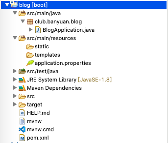
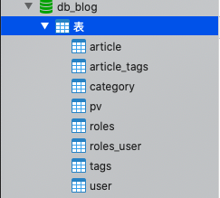
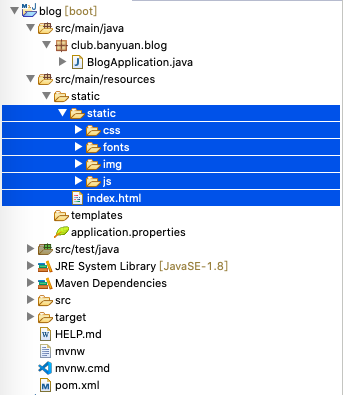
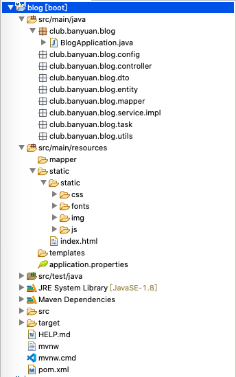
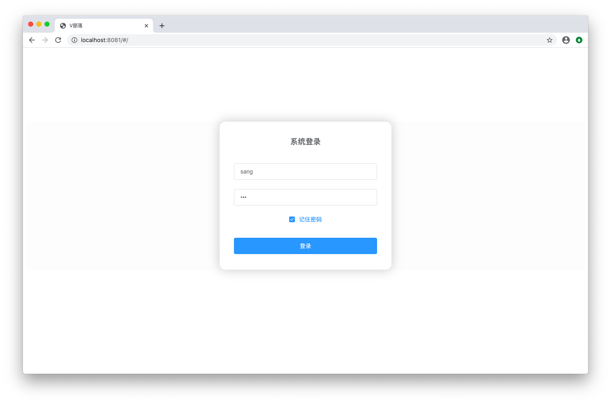

# 创建项目

## 准备工作

+ Java 开发环境
+ Maven
+ Springboot 插件
+ MySQL
+ Redis

## 新建Springboot项目

File -> New -> Project... <br/>

选择 Spring Starter Project <br/>
点击 Next <br/>

Name 填入项目名 `blog` <br/>
Group 填入 `club.banyuan` <br/>
Package 填入包名 `club.banyuan.blog` <br/>
点击 Next <br/>

依赖中勾选 Spring Web <br/>
点击 Finish <br/>

等待 Spring Boot 项目构建 <br/>


## 创建表
执行资源包下 `db_blog_init.sql` <br/>
用来创建数据库和表 <br/>


## 前端资源
解压资源包下 `static.zip` 拷贝到项目 `src/main/resources` 下的 static 文件夹下，拷贝完成结构如下 <br/>


## 创建 Package
在 `src/main/java` 下创建 <br/>
club.banyuan.blog.config <br/>
club.banyuan.blog.controller <br/>
club.banyuan.blog.dto <br/>
club.banyuan.blog.entity <br/>
club.banyuan.blog.mapper <br/>
club.banyuan.blog.service <br/>
club.banyuan.blog.service.impl <br/>
club.banyuan.blog.task <br/>
club.banyuan.blog.utils <br/>

在 `src/main/resources` 下创建 <br/>
mapper <br/>


## 添加依赖
在项目的 `pom.xml` 添加依赖
```xml
<dependency>
	<groupId>mysql</groupId>
	<artifactId>mysql-connector-java</artifactId>
</dependency>
		
<dependency>
    <groupId>org.mybatis.spring.boot</groupId>
    <artifactId>mybatis-spring-boot-starter</artifactId>
    <version>2.0.0</version>
</dependency>
```
## 修改配置
在项目 `src/main/resources` 下 `application.properties` 修改文件后缀成 `application.yml` <br/>
```yml
server:
  port: 8081

spring:
  datasource:
    url: jdbc:mysql://localhost:3306/db_blog?useUnicode=true&characterEncoding=utf-8
    username: root
    password: 123456
    driver-class-name: com.mysql.cj.jdbc.Driver

mybatis:
  mapper-locations: classpath:mapper/*.xml
  configuration:
    map-underscore-to-camel-case: true
```

## 添加 `@MapperScan` 注解
在启动文件 `BlogApplication.java` <br/>
添加 `@MapperScan` 注解 <br/>
```java
package club.banyuan.blog;

import org.mybatis.spring.annotation.MapperScan;
import org.springframework.boot.SpringApplication;
import org.springframework.boot.autoconfigure.SpringBootApplication;

@SpringBootApplication
@MapperScan("club.banyuan.blog.mapper")
public class BlogApplication {

	public static void main(String[] args) {
		SpringApplication.run(BlogApplication.class, args);
	}

}
```

## 试运行
启动Springboot项目 <br/>
在浏览器地址栏输入 <br/>
```
localhost:8081
```
可以看到登录页面正常显示


## 练习
创建好项目并能够正常显示登录页面 <br/>
提前了解下 springboot security 相关知识 <br/>
