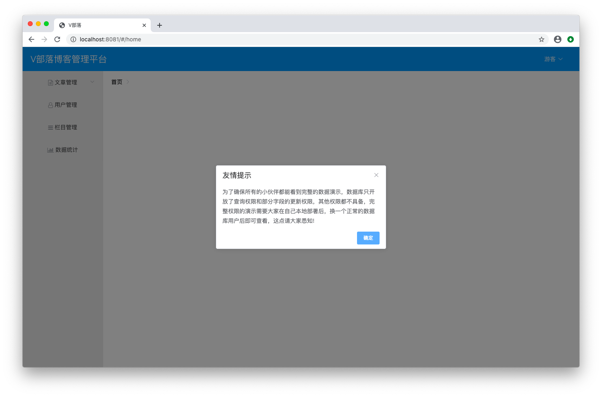

# 登录模块

## 添加依赖
```xml
<dependency>
	<groupId>org.springframework.boot</groupId>
	<artifactId>spring-boot-starter-security</artifactId>
</dependency>
```

## 新建RoleEntity.java
在 `club.banyuan.blog.entity` 下新建 `RoleEntity.java`
```java
package club.banyuan.blog.entity;

import java.io.Serializable;

public class RoleEntity implements Serializable {

	/**
	 * 
	 */
	private static final long serialVersionUID = 1L;
	
	private Long id;
    private String name;
	public Long getId() {
		return id;
	}
	public void setId(Long id) {
		this.id = id;
	}
	public String getName() {
		return name;
	}
	public void setName(String name) {
		this.name = name;
	}

}
```

## 新建UserEntity.java
在 `club.banyuan.blog.entity` 下新建 `UserEntity.java`
```java
package club.banyuan.blog.entity;

import java.io.Serializable;
import java.sql.Timestamp;
import java.util.List;

public class UserEntity implements Serializable {

	/**
	 * 
	 */
	private static final long serialVersionUID = 1L;
	
	private Long id;
    private String username;
    private String password;
    private String nickname;
    private boolean enabled;
    private List<RoleEntity> roles;
    private String email;
    private String userface;
    private Timestamp regTime;
	public Long getId() {
		return id;
	}
	public void setId(Long id) {
		this.id = id;
	}
	public String getUsername() {
		return username;
	}
	public void setUsername(String username) {
		this.username = username;
	}
	public String getPassword() {
		return password;
	}
	public void setPassword(String password) {
		this.password = password;
	}
	public String getNickname() {
		return nickname;
	}
	public void setNickname(String nickname) {
		this.nickname = nickname;
	}
	public boolean isEnabled() {
		return enabled;
	}
	public void setEnabled(boolean enabled) {
		this.enabled = enabled;
	}
	public List<RoleEntity> getRoles() {
		return roles;
	}
	public void setRoles(List<RoleEntity> roles) {
		this.roles = roles;
	}
	public String getEmail() {
		return email;
	}
	public void setEmail(String email) {
		this.email = email;
	}
	public String getUserface() {
		return userface;
	}
	public void setUserface(String userface) {
		this.userface = userface;
	}
	public Timestamp getRegTime() {
		return regTime;
	}
	public void setRegTime(Timestamp regTime) {
		this.regTime = regTime;
	}

}
```

## 新建UserMapper.java
在 `club.banyuan.blog.mapper` 下新建 `UserMapper.java`
```java
package club.banyuan.blog.mapper;

import org.apache.ibatis.annotations.Param;

import club.banyuan.blog.entity.UserEntity;

public interface UserMapper {

	public UserEntity getUserByUsername(@Param("username") String username);
}
```

## 新建UserMapper.xml
在 `src/main/resources/mapper` 下新建 `UserMapper.xml`
```xml
<?xml version="1.0" encoding="UTF-8"?>
<!DOCTYPE mapper PUBLIC "-//mybatis.org//DTD Mapper 3.0//EN" "http://mybatis.org/dtd/mybatis-3-mapper.dtd">
<mapper namespace="club.banyuan.blog.mapper.UserMapper">
	<resultMap type="club.banyuan.blog.entity.UserEntity" id="BaseResultMap">
		<id column="id" jdbcType="INTEGER" property="id"/>
        <result column="username" jdbcType="VARCHAR" property="username"/>
        <result column="nickname" jdbcType="VARCHAR" property="nickname"/>
        <result column="password" jdbcType="VARCHAR" property="password"/>
        <result column="enabled" jdbcType="INTEGER" property="enabled"/>
        <result column="email" jdbcType="VARCHAR" property="email"/>
        <result column="userface" jdbcType="VARCHAR" property="userface"/>
        <result column="regTime" jdbcType="TIMESTAMP" property="regTime"/>
        <collection property="roles" ofType="club.banyuan.blog.entity.RoleEntity">
        	<id column="rid" property="id"/>
            <result column="rname" property="name"/>
        </collection>
	</resultMap>
	
	<select id="getUserByUsername" resultType="club.banyuan.blog.entity.UserEntity">
		select id, username, password, enabled from user where username=#{username}
	</select>
</mapper>
```

## 新建LoginUserDto.java
在 `club.banyuan.blog.dto` 下新建 `LoginUserDto.java`
```java
package club.banyuan.blog.dto;

import java.util.ArrayList;
import java.util.Collection;
import java.util.List;

import org.springframework.security.core.GrantedAuthority;
import org.springframework.security.core.userdetails.UserDetails;

public class LoginUserDto implements UserDetails {
	
	/**
	 * 
	 */
	private static final long serialVersionUID = 1L;

    private Long id;
    private String username;
    private String password;
    private boolean enabled;

	public Long getId() {
		return id;
	}

	public void setId(Long id) {
		this.id = id;
	}

	public void setUsername(String username) {
		this.username = username;
	}

	public void setPassword(String password) {
		this.password = password;
	}

	public void setEnabled(boolean enabled) {
		this.enabled = enabled;
	}

	@Override
	public Collection<? extends GrantedAuthority> getAuthorities() {
		List<GrantedAuthority> authorities = new ArrayList<>();
		// TODO Auto-generated method stub
		return authorities;
	}

	@Override
	public String getPassword() {
		return password;
	}

	@Override
	public String getUsername() {
		return username;
	}

	@Override
	public boolean isAccountNonExpired() {
		return true;
	}

	@Override
	public boolean isAccountNonLocked() {
		return true;
	}

	@Override
	public boolean isCredentialsNonExpired() {
		return true;
	}

	@Override
	public boolean isEnabled() {
		return enabled;
	}

}
```

## 新建LoginService.java
在 `club.banyuan.blog.service` 下新建 `LoginService.java`
```java
package club.banyuan.blog.service;

import org.springframework.beans.BeanUtils;
import org.springframework.beans.factory.annotation.Autowired;
import org.springframework.security.core.userdetails.UserDetails;
import org.springframework.security.core.userdetails.UserDetailsService;
import org.springframework.security.core.userdetails.UsernameNotFoundException;
import org.springframework.stereotype.Service;

import club.banyuan.blog.dto.LoginUserDto;
import club.banyuan.blog.entity.UserEntity;
import club.banyuan.blog.mapper.UserMapper;

@Service
public class LoginService implements UserDetailsService {
	
	@Autowired
	private UserMapper userMapper;

	@Override
	public UserDetails loadUserByUsername(String username) throws UsernameNotFoundException {
		UserEntity userEntity = userMapper.getUserByUsername(username);
		if (userEntity == null) {
			return new LoginUserDto();
		}
		LoginUserDto loginUserDto = new LoginUserDto();
		BeanUtils.copyProperties(userEntity, loginUserDto);
		return loginUserDto;
	}

}
```

## 新建AuthSuccessHandler.java
在 `club.banyuan.blog.config` 下新建 `AuthSuccessHandler.java`
```java
package club.banyuan.blog.config;

import java.io.IOException;
import java.io.PrintWriter;

import javax.servlet.ServletException;
import javax.servlet.http.HttpServletRequest;
import javax.servlet.http.HttpServletResponse;

import org.springframework.security.core.Authentication;
import org.springframework.security.web.authentication.AuthenticationSuccessHandler;

public class AuthSuccessHandler implements AuthenticationSuccessHandler {

	@Override
	public void onAuthenticationSuccess(HttpServletRequest request, HttpServletResponse response,
			Authentication authentication) throws IOException, ServletException {
		response.setContentType("application/json;charset=utf-8");
		PrintWriter out = response.getWriter();
		out.write("{\"status\":\"success\",\"msg\":\"登录成功\"}");
		out.flush();
		out.close();
	}

}
```

## 新建AuthFailureHandler.java
在 `club.banyuan.blog.config` 下新建 `AuthFailureHandler.java`
```java
package club.banyuan.blog.config;

import java.io.IOException;
import java.io.PrintWriter;

import javax.servlet.ServletException;
import javax.servlet.http.HttpServletRequest;
import javax.servlet.http.HttpServletResponse;

import org.springframework.security.core.AuthenticationException;
import org.springframework.security.web.authentication.AuthenticationFailureHandler;

public class AuthFailureHandler implements AuthenticationFailureHandler {

	@Override
	public void onAuthenticationFailure(HttpServletRequest request, HttpServletResponse response,
			AuthenticationException exception) throws IOException, ServletException {
		response.setContentType("application/json;charset=utf-8");
        PrintWriter out = response.getWriter();
        out.write("{\"status\":\"error\",\"msg\":\"登录失败\"}");
        out.flush();
        out.close();
	}

}
```

## 新建AuthAccessDeniedHandler.java
在 `club.banyuan.blog.config` 下新建 `AuthAccessDeniedHandler.java`
```java
package club.banyuan.blog.config;

import java.io.IOException;
import java.io.PrintWriter;

import javax.servlet.ServletException;
import javax.servlet.http.HttpServletRequest;
import javax.servlet.http.HttpServletResponse;

import org.springframework.security.access.AccessDeniedException;
import org.springframework.security.web.access.AccessDeniedHandler;

public class AuthAccessDeniedHandler implements AccessDeniedHandler {

	@Override
	public void handle(HttpServletRequest request, HttpServletResponse response,
			AccessDeniedException accessDeniedException) throws IOException, ServletException {
		response.setStatus(HttpServletResponse.SC_FORBIDDEN);
		response.setCharacterEncoding("UTF-8");
        PrintWriter out = response.getWriter();
        out.write("权限不足,请联系管理员!");
        out.flush();
        out.close();
	}

}
```

## 新建WebSecurityConfig.java
在 `club.banyuan.blog.config` 下新建 `WebSecurityConfig.java`
```java
package club.banyuan.blog.config;

import org.springframework.beans.factory.annotation.Autowired;
import org.springframework.context.annotation.Bean;
import org.springframework.context.annotation.Configuration;
import org.springframework.security.config.annotation.authentication.builders.AuthenticationManagerBuilder;
import org.springframework.security.config.annotation.web.builders.HttpSecurity;
import org.springframework.security.config.annotation.web.builders.WebSecurity;
import org.springframework.security.config.annotation.web.configuration.WebSecurityConfigurerAdapter;
import org.springframework.security.web.access.AccessDeniedHandler;
import org.springframework.security.web.authentication.AuthenticationFailureHandler;
import org.springframework.security.web.authentication.AuthenticationSuccessHandler;

import club.banyuan.blog.service.LoginService;

@Configuration
public class WebSecurityConfig extends WebSecurityConfigurerAdapter {

	@Autowired
	private LoginService loginService;
	
	@Override
	protected void configure(AuthenticationManagerBuilder auth) throws Exception {
		auth.userDetailsService(loginService);
	}
	
	@Override
	protected void configure(HttpSecurity http) throws Exception {
		http.authorizeRequests()
			.antMatchers("/admin/category/all").authenticated()
			.antMatchers("/admin/**").hasRole("超级管理员")
			.anyRequest().authenticated()
			.and().formLogin().loginPage("/")
			.successHandler(getAuthenticationSuccessHandler())
			.failureHandler(getAuthenticationFailureHandler())
			.loginProcessingUrl("/login")
			.usernameParameter("username").passwordParameter("password").permitAll()
			.and().logout().permitAll().and().csrf().disable().exceptionHandling()
			.accessDeniedHandler(getAccessDeniedHandler());
	}
	
	@Override
	public void configure(WebSecurity web) throws Exception {
		web.ignoring().antMatchers("/blogimg/**","/index.html","/static/**");
	}
	
	@Bean
	AuthenticationSuccessHandler getAuthenticationSuccessHandler() {
		return new AuthSuccessHandler();
	}
	
	@Bean
	AuthenticationFailureHandler getAuthenticationFailureHandler() {
		return new AuthFailureHandler();
	}
	
	@Bean
	AccessDeniedHandler getAccessDeniedHandler() {
		return new AuthAccessDeniedHandler();
	}
}
```

## 新建MyPasswordEncoder.java
在 `club.banyuan.blog.config` 下新建 `MyPasswordEncoder.java`
```java
package club.banyuan.blog.config;

import org.springframework.security.crypto.password.PasswordEncoder;
import org.springframework.stereotype.Component;
import org.springframework.util.DigestUtils;

@Component
public class MyPasswordEncoder implements PasswordEncoder {

	@Override
	public String encode(CharSequence rawPassword) {
		return DigestUtils.md5DigestAsHex(rawPassword.toString().getBytes());
	}

	@Override
	public boolean matches(CharSequence rawPassword, String encodedPassword) {
		return encodedPassword.equals(DigestUtils.md5DigestAsHex(rawPassword.toString().getBytes()));
	}

}
```

## 新增一条用户数据
```
INSERT INTO `user`(username, nickname, `password`, enabled) VALUES ('sang', '半圆', '202cb962ac59075b964b07152d234b70', '1');
```

## 试登录
启动Springboot项目 <br/>
在浏览器地址栏输入 <br/>
```
localhost:8081
```
进入登录页面点击登录成功进入首页


## 练习
完成登录模块并成功进入首页 <br>
