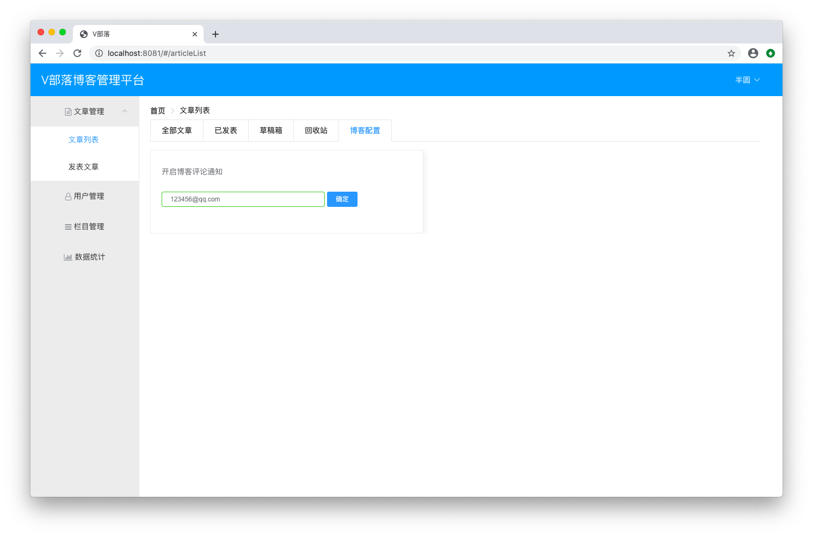

# 用户信息

## 获取用户昵称
### 新建UserUtil.java
```java
package club.banyuan.blog.utils;

import org.springframework.security.core.context.SecurityContextHolder;

import club.banyuan.blog.dto.LoginUserDto;

public class UserUtil {

	public static LoginUserDto getCurrentUser() {
		return (LoginUserDto)SecurityContextHolder.getContext().getAuthentication().getPrincipal();
	}
}
```

### 新建UserController.java
```java
package club.banyuan.blog.controller;

import org.springframework.web.bind.annotation.RequestMapping;
import org.springframework.web.bind.annotation.RestController;

import club.banyuan.blog.utils.UserUtil;

@RestController
public class UserController {

	@RequestMapping("/currentUserName")
	public String currentUserName() {
		return UserUtil.getCurrentUser().getUsername();
	}
}
```

### 启动项目
项目启动之后进行登录，可以看到右上角显示了用户名 <br/>


但是这里的用户名显示的是登录名，而我们希望显示的是用户昵称 <br/>

### 改造UserMapper.xml
SQL 语句添加查询 nickname
```xml
<select id="getUserByUsername" resultType="club.banyuan.blog.entity.UserEntity">
	select id, username, nickname, password, enabled from user where username=#{username}
</select>
```

### 改造LoginUserDto.java
添加 `nickname` 及 `get/set` 方法
```java
private String nickname;

public String getNickname() {
	return nickname;
}

public void setNickname(String nickname) {
	this.nickname = nickname;
}
```

### 改造UserController.java
将 `getUsername` 换成 `getNickname`
```java
@RequestMapping("/currentUserName")
public String currentUserName() {
	return UserUtil.getCurrentUser().getNickname();
}
```

### 重新启动项目
再次登录进来可以看到右上角已经成功显示了用户昵称 <br/>


## 邮箱显示和修改
文章管理 -> 文章列表 -> 博客配置

### 改造UserMapper.java
新增 `getUserById` `updateUserEmail` 方法定义
```java
public UserEntity getUserById(@Param("id") Long id);
	
public int updateUserEmail(@Param("id") Long id, @Param("email") String email);
```

### 改造UserMapper.xml
完成 `getUserById` `updateUserEmail` 的 SQL 实现
```xml
<sql id="Base_Column_List">
	id, username, nickname, enabled, email, userface, regTime
</sql>
<select id="getUserById" resultType="club.banyuan.blog.entity.UserEntity">
	select <include refid="Base_Column_List" />
	from user where id = #{id}
</select>
	
<update id="updateUserEmail">
    update user set email = #{email} WHERE id = #{id}
</update>
```

### 新建UserBaseDto.java
```java
package club.banyuan.blog.dto;

import java.sql.Timestamp;

public class UserBaseDto {

	private Long id;
    private String username;
    private String password;
    private String nickname;
    private boolean enabled;
    private String email;
    private String userface;
    private Timestamp regTime;
	public Long getId() {
		return id;
	}
	public void setId(Long id) {
		this.id = id;
	}
	public String getUsername() {
		return username;
	}
	public void setUsername(String username) {
		this.username = username;
	}
	public String getPassword() {
		return password;
	}
	public void setPassword(String password) {
		this.password = password;
	}
	public String getNickname() {
		return nickname;
	}
	public void setNickname(String nickname) {
		this.nickname = nickname;
	}
	public boolean isEnabled() {
		return enabled;
	}
	public void setEnabled(boolean enabled) {
		this.enabled = enabled;
	}
	public String getEmail() {
		return email;
	}
	public void setEmail(String email) {
		this.email = email;
	}
	public String getUserface() {
		return userface;
	}
	public void setUserface(String userface) {
		this.userface = userface;
	}
	public Timestamp getRegTime() {
		return regTime;
	}
	public void setRegTime(Timestamp regTime) {
		this.regTime = regTime;
	}
    
}
```

### 新建UserService.java
```java
package club.banyuan.blog.service;

import club.banyuan.blog.dto.UserBaseDto;

public interface UserService {

	public UserBaseDto getUserBaseInfoById();
	public boolean updateUserEmail(String email);
}
```

### 新建UserServiceImpl.java
```java
package club.banyuan.blog.service.impl;

import org.springframework.beans.BeanUtils;
import org.springframework.beans.factory.annotation.Autowired;
import org.springframework.stereotype.Service;

import club.banyuan.blog.dto.UserBaseDto;
import club.banyuan.blog.entity.UserEntity;
import club.banyuan.blog.mapper.UserMapper;
import club.banyuan.blog.service.UserService;
import club.banyuan.blog.utils.UserUtil;

@Service
public class UserServiceImpl implements UserService {

	@Autowired
	private UserMapper userMapper;

	@Override
	public UserBaseDto getUserBaseInfoById() {
		UserEntity userEntity = userMapper.getUserById(UserUtil.getCurrentUser().getId());
		UserBaseDto userBaseDto = new UserBaseDto();
		if (userEntity != null) {
			BeanUtils.copyProperties(userEntity, userBaseDto);
		}
		return userBaseDto;
	}

	@Override
	public boolean updateUserEmail(String email) {
		return userMapper.updateUserEmail(UserUtil.getCurrentUser().getId(), email) > 0;
	}

}
```

### 新建Result.java
```java
package club.banyuan.blog.dto;

public class Result {

	private String status;
    private String msg;
	
    public Result(String status, String msg) {
		super();
		this.status = status;
		this.msg = msg;
	}
    
    public String getStatus() {
		return status;
	}
	public void setStatus(String status) {
		this.status = status;
	}
	public String getMsg() {
		return msg;
	}
	public void setMsg(String msg) {
		this.msg = msg;
	}

}
```

### 改造UserController.java
```java
package club.banyuan.blog.controller;

import org.springframework.beans.factory.annotation.Autowired;
import org.springframework.web.bind.annotation.RequestMapping;
import org.springframework.web.bind.annotation.RequestMethod;
import org.springframework.web.bind.annotation.RestController;

import club.banyuan.blog.dto.Result;
import club.banyuan.blog.dto.UserBaseDto;
import club.banyuan.blog.service.UserService;
import club.banyuan.blog.utils.UserUtil;

@RestController
public class UserController {
	
	@Autowired
	private UserService userService;

	@RequestMapping("/currentUserName")
	public String currentUserName() {
		return UserUtil.getCurrentUser().getNickname();
	}
	
	@RequestMapping("/currentUserEmail")
	public String currentUserEmail() {
		UserBaseDto userBaseDto = userService.getUserBaseInfoById();
		if (userBaseDto != null) {
			return userBaseDto.getEmail();
		}
		return "";
	}
	
	@RequestMapping(value = "/updateUserEmail", method = RequestMethod.PUT)
	public Result updateUserEmail(String email) {
		if (userService.updateUserEmail(email)) {
			return new Result("success", "开启成功!");
		}
		return new Result("error", "开启失败!");
	}
}
```

### 运行
启动项目登录之后在 <br/>
文章管理 -> 文章列表 -> 博客配置 <br/>
填入 `123456@qq.com` 并按确定按钮 <br/>
可以看到邮箱更新成功 <br/>


退出重新登录再进来还是能够看到 <br/>


去数据库查询一下数据，可以看到email这个字段确实更新了 <br/>


## 角色权限

### 角色表新增几条角色数据
```
INSERT INTO `roles`(id, name) VALUES ('1', '超级管理员');
INSERT INTO `roles`(id, name) VALUES ('2', '普通用户');
INSERT INTO `roles`(id, name) VALUES ('3', '测试角色1');
INSERT INTO `roles`(id, name) VALUES ('4', '测试角色2');
INSERT INTO `roles`(id, name) VALUES ('5', '测试角色3');
```

### 用户角色表给用户加几个角色
```
INSERT INTO `roles_user`(rid, uid) VALUES ('1', '1');
INSERT INTO `roles_user`(rid, uid) VALUES ('2', '1');
INSERT INTO `roles_user`(rid, uid) VALUES ('3', '1');
```

### 新建RoleMapper.java
```java
package club.banyuan.blog.mapper;

import java.util.List;

import club.banyuan.blog.entity.RoleEntity;

public interface RoleMapper {

	List<RoleEntity> getRolesByUid(Long uid);
}
```

### 新建RoleMapper.xml
```xml
<?xml version="1.0" encoding="UTF-8"?>
<!DOCTYPE mapper PUBLIC "-//mybatis.org//DTD Mapper 3.0//EN" "http://mybatis.org/dtd/mybatis-3-mapper.dtd">
<mapper namespace="club.banyuan.blog.mapper.RoleMapper">
	<select id="getRolesByUid" parameterType="long" resultType="club.banyuan.blog.entity.RoleEntity">
		select r.id, r.name
		from roles r, roles_user ru
		where r.id = ru.rid and ru.uid = #{uid} 
	</select>
</mapper>
```

### 新建RoleDto.java
```java
package club.banyuan.blog.dto;

public class RoleDto {

	private Long id;
    private String name;
	public Long getId() {
		return id;
	}
	public void setId(Long id) {
		this.id = id;
	}
	public String getName() {
		return name;
	}
	public void setName(String name) {
		this.name = name;
	}

}
```

### 改造LoginUserDto.java
新增 `roles` 及 `get/set` 方法
```java
private List<RoleDto> roles;
public List<RoleDto> getRoles() {
	return roles;
}

public void setRoles(List<RoleDto> roles) {
	this.roles = roles;
}
```
方法 `getAuthorities` 改造如下
```java
@Override
@JsonIgnore
public List<GrantedAuthority> getAuthorities() {
	List<GrantedAuthority> authorities = new ArrayList<>();
	for (RoleDto role : roles) {
		authorities.add(new SimpleGrantedAuthority("ROLE_" + role.getName()));
	}
	return authorities;
}
```

### 改造LoginService.java
```java
package club.banyuan.blog.service;

import java.util.ArrayList;
import java.util.List;

import org.springframework.beans.BeanUtils;
import org.springframework.beans.factory.annotation.Autowired;
import org.springframework.security.core.userdetails.UserDetails;
import org.springframework.security.core.userdetails.UserDetailsService;
import org.springframework.security.core.userdetails.UsernameNotFoundException;
import org.springframework.stereotype.Service;

import club.banyuan.blog.dto.LoginUserDto;
import club.banyuan.blog.dto.RoleDto;
import club.banyuan.blog.entity.RoleEntity;
import club.banyuan.blog.entity.UserEntity;
import club.banyuan.blog.mapper.RoleMapper;
import club.banyuan.blog.mapper.UserMapper;

@Service
public class LoginService implements UserDetailsService {
	
	@Autowired
	private UserMapper userMapper;
	
	@Autowired
	private RoleMapper roleMapper;

	@Override
	public UserDetails loadUserByUsername(String username) throws UsernameNotFoundException {
		UserEntity userEntity = userMapper.getUserByUsername(username);
		if (userEntity == null) {
			return new LoginUserDto();
		}
		LoginUserDto loginUserDto = new LoginUserDto();
		BeanUtils.copyProperties(userEntity, loginUserDto);
		List<RoleEntity> roleEntityList = roleMapper.getRolesByUid(loginUserDto.getId());
		if (roleEntityList != null) {
			List<RoleDto> roleDtoList = new ArrayList<RoleDto>();
			for (RoleEntity roleEntity : roleEntityList) {
				RoleDto roleDto = new RoleDto();
				BeanUtils.copyProperties(roleEntity, roleDto);
				roleDtoList.add(roleDto);
			}
			loginUserDto.setRoles(roleDtoList);
		}
		return loginUserDto;
	}

}
```

### 改造UserController.java
新增接口 `/isAdmin`
```java
@RequestMapping("/isAdmin")
public Boolean isAdmin() {
	List<GrantedAuthority> authorities =
			(List<GrantedAuthority>) UserUtil.getCurrentUser().getAuthorities();
	for (GrantedAuthority grantedAuthority : authorities) {
		if (grantedAuthority.getAuthority().contains("超级管理员")) {
			return true;
		}
	}
	return false;
}
```

## 启动

可以看到 isAdmin 接口成功返回了 true <br/>
点击下面的用户管理及栏目管理也没有再提示权限不足 <br/>


## 练习
完成用户信息模块 <br/>
