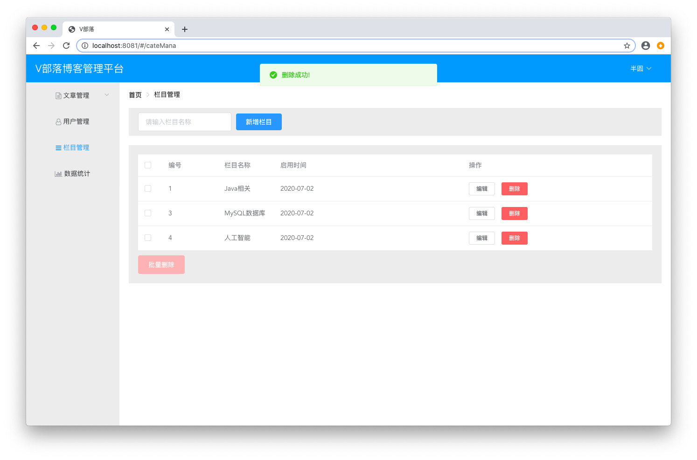

# 栏目管理

## 代码

### 新建CategoryEntity.java
```java
package club.banyuan.blog.entity;

import java.io.Serializable;
import java.sql.Timestamp;

public class CategoryEntity implements Serializable {
	
	/**
	 * 
	 */
	private static final long serialVersionUID = 1L;
	private Long id;
    private String cateName;
    private Timestamp date;

	public Long getId() {
		return id;
	}
	public void setId(Long id) {
		this.id = id;
	}
	public String getCateName() {
		return cateName;
	}
	public void setCateName(String cateName) {
		this.cateName = cateName;
	}
	public Timestamp getDate() {
		return date;
	}
	public void setDate(Timestamp date) {
		this.date = date;
	}

}
```

### 新建CategoryMapper.java
```java
package club.banyuan.blog.mapper;

import java.util.List;

import org.apache.ibatis.annotations.Param;

import club.banyuan.blog.entity.CategoryEntity;

public interface CategoryMapper {

	List<CategoryEntity> getAllCategories();

	int addCategory(CategoryEntity category);

	int updateCategoryById(CategoryEntity category);

	int deleteCategoryByIds(@Param("ids") String[] ids);
}
```

### 新建CategoryMapper.xml
```xml
<?xml version="1.0" encoding="UTF-8"?>
<!DOCTYPE mapper PUBLIC "-//mybatis.org//DTD Mapper 3.0//EN" "http://mybatis.org/dtd/mybatis-3-mapper.dtd">
<mapper namespace="club.banyuan.blog.mapper.CategoryMapper">
	<resultMap id="BaseResultMap" type="club.banyuan.blog.entity.CategoryEntity">
		<id column="id" jdbcType="INTEGER" property="id"/>
        <result column="cateName" jdbcType="VARCHAR" property="cateName"/>
        <result column="date" jdbcType="TIMESTAMP" property="date"/>
	</resultMap>
	
	<sql id="Base_Column_List">
		id, cateName, date
	</sql>
	
	<select id="getAllCategories" resultType="club.banyuan.blog.entity.CategoryEntity">
		select <include refid="Base_Column_List"/>
		from category
	</select>
	
	<insert id="addCategory" parameterType="club.banyuan.blog.entity.CategoryEntity">
		insert into category set date = #{date}, cateName = #{cateName}
	</insert>
	
	<update id="updateCategoryById" parameterType="club.banyuan.blog.entity.CategoryEntity">
		update category set cateName = #{cateName} WHERE id = #{id}
	</update>
	
	<delete id="deleteCategoryByIds">
		delete from category where id in
		<foreach collection="ids" separator="," open="(" close=")" item="id">
            #{id}
        </foreach>
	</delete>
</mapper>
```

### 新建CategoryDto.java
```java
package club.banyuan.blog.dto;

import java.sql.Timestamp;

public class CategoryDto {

	private Long id;
    private String cateName;
    private Timestamp date;

	public Long getId() {
		return id;
	}
	public void setId(Long id) {
		this.id = id;
	}
	public String getCateName() {
		return cateName;
	}
	public void setCateName(String cateName) {
		this.cateName = cateName;
	}
	public Timestamp getDate() {
		return date;
	}
	public void setDate(Timestamp date) {
		this.date = date;
	}

}
```

### 新建CategoryService.java
```java
package club.banyuan.blog.service;

import java.util.List;

import club.banyuan.blog.dto.CategoryDto;

public interface CategoryService {

	public List<CategoryDto> getAllCategories();
	
	public boolean addCategory(CategoryDto category);
	
	public boolean updateCategory(CategoryDto category);
	
	public boolean deleteCategoryByIds(String ids);
}
```

### 新建CategoryServiceImpl.java
```java
package club.banyuan.blog.service.impl;

import java.sql.Timestamp;
import java.util.ArrayList;
import java.util.List;

import org.springframework.beans.BeanUtils;
import org.springframework.beans.factory.annotation.Autowired;
import org.springframework.stereotype.Service;

import club.banyuan.blog.dto.CategoryDto;
import club.banyuan.blog.entity.CategoryEntity;
import club.banyuan.blog.mapper.CategoryMapper;
import club.banyuan.blog.service.CategoryService;

@Service
public class CategoryServiceImpl implements CategoryService {

	@Autowired
	private CategoryMapper categoryMapper;
	
	@Override
	public List<CategoryDto> getAllCategories() {
		List<CategoryEntity> categoryEntities = categoryMapper.getAllCategories();
		List<CategoryDto> categoryDtos = new ArrayList<CategoryDto>();
		if (categoryEntities != null) {
			for (CategoryEntity categoryEntity : categoryEntities) {
				CategoryDto categoryDto = new CategoryDto();
				BeanUtils.copyProperties(categoryEntity, categoryDto);
				categoryDtos.add(categoryDto);
			}
		}
		return categoryDtos;
	}

	@Override
	public boolean addCategory(CategoryDto category) {
		CategoryEntity categoryEntity = new CategoryEntity();
		categoryEntity.setCateName(category.getCateName());
		categoryEntity.setDate(new Timestamp(System.currentTimeMillis()));

		return categoryMapper.addCategory(categoryEntity) > 0;
	}

	@Override
	public boolean updateCategory(CategoryDto category) {
		CategoryEntity categoryEntity = new CategoryEntity();
		categoryEntity.setId(category.getId());
		categoryEntity.setCateName(category.getCateName());
		categoryEntity.setDate(new Timestamp(System.currentTimeMillis()));
		
		return categoryMapper.updateCategoryById(categoryEntity) > 0;
	}

	@Override
	public boolean deleteCategoryByIds(String ids) {
		String[] idList = ids.split(",");
		return categoryMapper.deleteCategoryByIds(idList) == idList.length;
	}

}
```

### 新建CategoryController.java
```java
package club.banyuan.blog.controller;

import java.util.List;

import org.springframework.beans.factory.annotation.Autowired;
import org.springframework.web.bind.annotation.PathVariable;
import org.springframework.web.bind.annotation.RequestMapping;
import org.springframework.web.bind.annotation.RequestMethod;
import org.springframework.web.bind.annotation.RestController;

import club.banyuan.blog.dto.CategoryDto;
import club.banyuan.blog.dto.Result;
import club.banyuan.blog.service.CategoryService;

@RestController
@RequestMapping("/admin/category")
public class CategoryController {

	@Autowired
	private CategoryService categoryService;
	
	@RequestMapping(value = "/all", method = RequestMethod.GET)
	public List<CategoryDto> getAllCategories() {
		return categoryService.getAllCategories();
	}
	
	@RequestMapping(value = "/", method = RequestMethod.POST)
	public Result addCategory(CategoryDto category) {
		if (category.getCateName() == null || "".equals(category.getCateName())) {
			return new Result("error", "请输入栏目名称!");
		}
		if (categoryService.addCategory(category)) {
			return new Result("success", "添加成功!");
		}
		return new Result("error", "添加失败!");
	}
	
	@RequestMapping(value = "/", method = RequestMethod.PUT)
	public Result updateCategory(CategoryDto category) {
		if (categoryService.updateCategory(category)) {
			return new Result("success", "修改成功!");
		}
		return new Result("error", "修改失败!");
	}
	
	@RequestMapping(value = "/{ids}", method = RequestMethod.DELETE)
	public Result deleteByIds(@PathVariable String ids) {
		if (categoryService.deleteCategoryByIds(ids)) {
			return new Result("success", "删除成功!");
		}
		return new Result("error", "删除失败!");
	}
}
```

## 运行

启动登录之后点击栏目管理 <br/>


### 新增栏目

新增几条栏目信息 <br/>


### 修改栏目

选择其中一条进行修改 <br/>


### 删除栏目

选择其中一条进行删除 <br/>




### 数据库

在数据库中查询最终的结果数据 <br/>


## 使用Redis

这里的栏目信息一般创建好之后，查询的频率会高，可以考虑使用 redis 存储查询结果 <br/>

### 添加Redis依赖
在项目的 `pom.xml` 文件 <br/>
添加依赖 <br/>
```
<dependency>
    <groupId>org.springframework.boot</groupId>
    <artifactId>spring-boot-starter-data-redis</artifactId>
</dependency>

<dependency>
	<groupId>org.apache.commons</groupId>
	<artifactId>commons-pool2</artifactId>
</dependency>

<dependency>
	<groupId>com.alibaba</groupId>
	<artifactId>fastjson</artifactId>
	<version>1.2.58</version>
</dependency>
```

### 配置Redis连接
在 `application.yml` 中添加以下配置信息
```
spring:
  redis:
    database: 0 # 数据库索引 默认0
    host: 127.0.0.1
    port: 6379
    timeout: 30000
    lettuce:
      pool:
        max-idle: 2 # 连接池中的最大空闲连接 默认8
        min-idle: 2 # 连接池中的最小空闲连接 默认0
        max-active: 2 # 连接池最大连接数 默认8 ，负数表示没有限制
        max-wait: -1 # 连接池最大阻塞等待时间（使用负值表示没有限制） 默认-1
```

### 创建RedisConfig类
在 `club.banyuan.blog.config` 下新建 `RedisConfig.java`
```java
package club.banyuan.blog.config;

import org.springframework.context.annotation.Bean;
import org.springframework.context.annotation.Configuration;
import org.springframework.data.redis.connection.lettuce.LettuceConnectionFactory;
import org.springframework.data.redis.core.RedisTemplate;
import org.springframework.data.redis.serializer.Jackson2JsonRedisSerializer;
import org.springframework.data.redis.serializer.StringRedisSerializer;

import com.fasterxml.jackson.annotation.JsonAutoDetect;
import com.fasterxml.jackson.annotation.PropertyAccessor;
import com.fasterxml.jackson.databind.ObjectMapper;

@Configuration
public class RedisConfig {

	@Bean
	public RedisTemplate<String, Object> redisTemplate(LettuceConnectionFactory connectionFactory) {
		RedisTemplate<String, Object> redisTemplate = new RedisTemplate<String, Object>();
		Jackson2JsonRedisSerializer<Object> jacksonSerial = new Jackson2JsonRedisSerializer<>(Object.class);
		ObjectMapper om = new ObjectMapper();
		om.setVisibility(PropertyAccessor.ALL, JsonAutoDetect.Visibility.ANY);
		om.enableDefaultTyping(ObjectMapper.DefaultTyping.NON_FINAL);
		jacksonSerial.setObjectMapper(om);
		
		redisTemplate.setKeySerializer(new StringRedisSerializer());
		redisTemplate.setHashKeySerializer(new StringRedisSerializer());
		redisTemplate.setValueSerializer(jacksonSerial);
		redisTemplate.setHashValueSerializer(jacksonSerial);
		redisTemplate.setConnectionFactory(connectionFactory);
		return redisTemplate;
	}
}
```

### 创建RedisUtil工具类
在 `club.banyuan.blog.utils` 下新建 `RedisUtil.java` <br/>
这里仅简单介绍 `expire` `get` `set` `del` 方法
```java
package club.banyuan.blog.utils;

import java.util.concurrent.TimeUnit;

import org.springframework.beans.factory.annotation.Autowired;
import org.springframework.data.redis.core.RedisTemplate;
import org.springframework.stereotype.Component;
import org.springframework.util.CollectionUtils;

@Component
public class RedisUtil {

	@Autowired
	private RedisTemplate<String, Object> redisTemplate;
	
	public boolean expire(String key, long time) {
		try {
			if (time > 0) {
				redisTemplate.expire(key, time, TimeUnit.SECONDS);
			}
			return true;
		} catch (Exception e) {
			e.printStackTrace();
			return false;
		}
	}
	
	public Object get(String key) {
		return key == null ? null : redisTemplate.opsForValue().get(key);
	}
	
	public boolean set(String key, Object value) {
		try {
			redisTemplate.opsForValue().set(key, value);
			return true;
		} catch (Exception e) {
			e.printStackTrace();
			return false;
		}
	}
	
	public boolean set(String key, Object value, long time) {
		try {
			if (time > 0) {
				redisTemplate.opsForValue().set(key, value, time, TimeUnit.SECONDS);
			} else {
				set(key, value);
			}
			return true;
		} catch (Exception e) {
			e.printStackTrace();
			return false;
		}
	}
	
	@SuppressWarnings("unchecked")
	public void del(String... key) {
		if (key != null && key.length > 0) {
			if (key.length == 1) {
				redisTemplate.delete(key[0]);
			} else {
				redisTemplate.delete(CollectionUtils.arrayToList(key));
			}
		}
	}

}
```

### 改造CategoryServiceImpl.java
```java
package club.banyuan.blog.service.impl;

import java.sql.Timestamp;
import java.util.ArrayList;
import java.util.List;

import org.springframework.beans.BeanUtils;
import org.springframework.beans.factory.annotation.Autowired;
import org.springframework.stereotype.Service;

import com.alibaba.fastjson.JSON;
import com.alibaba.fastjson.JSONArray;

import club.banyuan.blog.dto.CategoryDto;
import club.banyuan.blog.entity.CategoryEntity;
import club.banyuan.blog.mapper.CategoryMapper;
import club.banyuan.blog.service.CategoryService;
import club.banyuan.blog.utils.RedisUtil;

@Service
public class CategoryServiceImpl implements CategoryService {

	@Autowired
	private CategoryMapper categoryMapper;
	
	@Autowired
	private RedisUtil redisUtil;
	
	private static final String CATEGORY_LIST_KEY = "category:list";
	
	@Override
	public List<CategoryDto> getAllCategories() {
		List<CategoryDto> categoryDtos = new ArrayList<CategoryDto>();
		String categoryJSON = (String) redisUtil.get(CATEGORY_LIST_KEY);
		if (categoryJSON != null) {
			categoryDtos = JSONArray.parseArray(categoryJSON, CategoryDto.class);
			return categoryDtos;
		}
		
		List<CategoryEntity> categoryEntities = categoryMapper.getAllCategories();
		if (categoryEntities != null) {
			for (CategoryEntity categoryEntity : categoryEntities) {
				CategoryDto categoryDto = new CategoryDto();
				BeanUtils.copyProperties(categoryEntity, categoryDto);
				categoryDtos.add(categoryDto);
			}
			redisUtil.set(CATEGORY_LIST_KEY, JSON.toJSONString(categoryDtos));
		}
		
		return categoryDtos;
	}

	@Override
	public boolean addCategory(CategoryDto category) {
		CategoryEntity categoryEntity = new CategoryEntity();
		categoryEntity.setCateName(category.getCateName());
		categoryEntity.setDate(new Timestamp(System.currentTimeMillis()));

		boolean result = categoryMapper.addCategory(categoryEntity) > 0;
		redisUtil.del(CATEGORY_LIST_KEY);
		return result;
	}

	@Override
	public boolean updateCategory(CategoryDto category) {
		CategoryEntity categoryEntity = new CategoryEntity();
		categoryEntity.setId(category.getId());
		categoryEntity.setCateName(category.getCateName());
		categoryEntity.setDate(new Timestamp(System.currentTimeMillis()));
		
		boolean result =  categoryMapper.updateCategoryById(categoryEntity) > 0;
		redisUtil.del(CATEGORY_LIST_KEY);
		return result;
	}

	@Override
	public boolean deleteCategoryByIds(String ids) {
		String[] idList = ids.split(",");
		
		boolean result = categoryMapper.deleteCategoryByIds(idList) == idList.length;
		redisUtil.del(CATEGORY_LIST_KEY);
		return result;
	}

}
```

## 重新启动运行
再次查询可以看到 redis 已经存有数据了 <br/>


## 练习
完成栏目管理 <br/>
