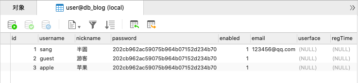
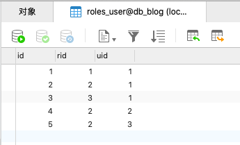
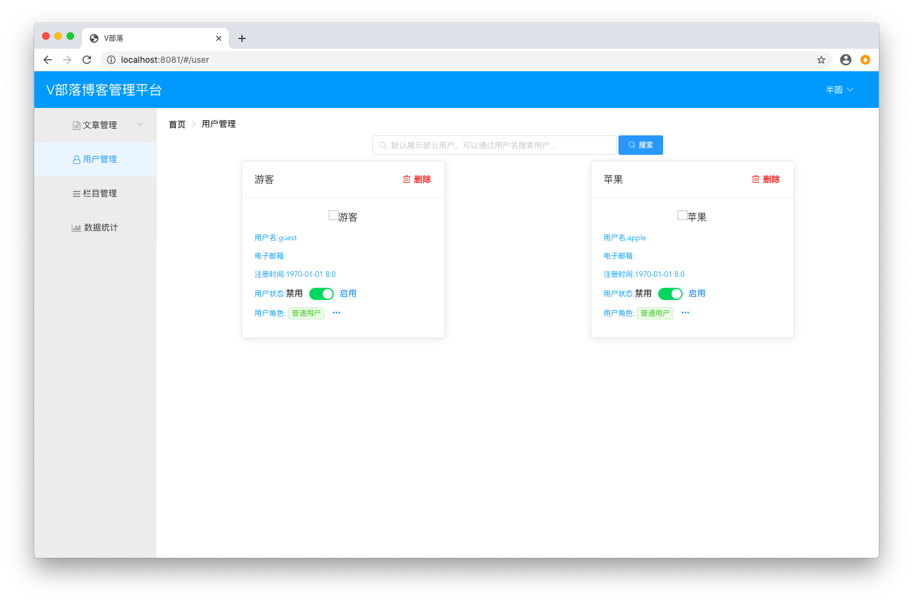
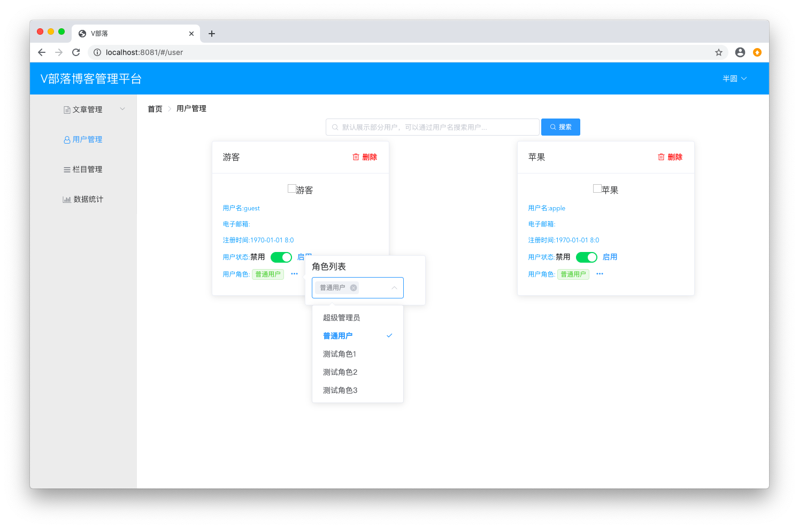
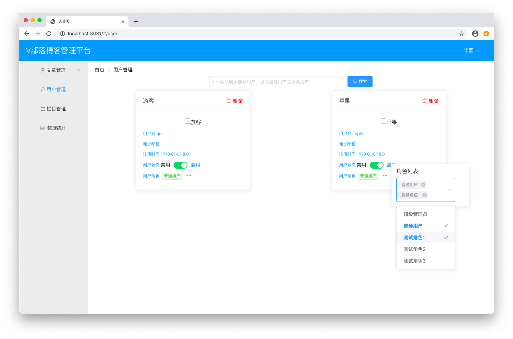
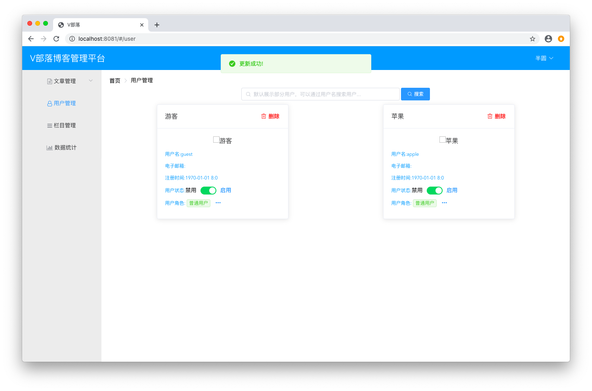
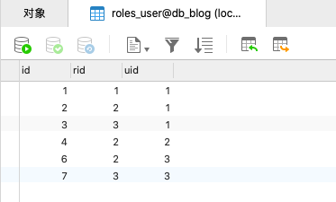
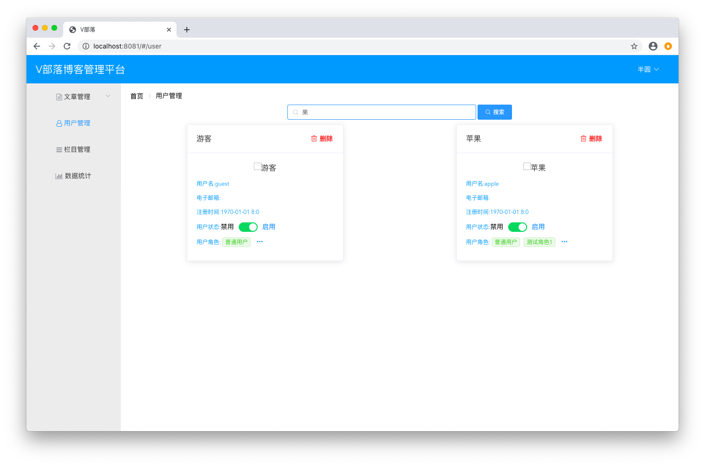
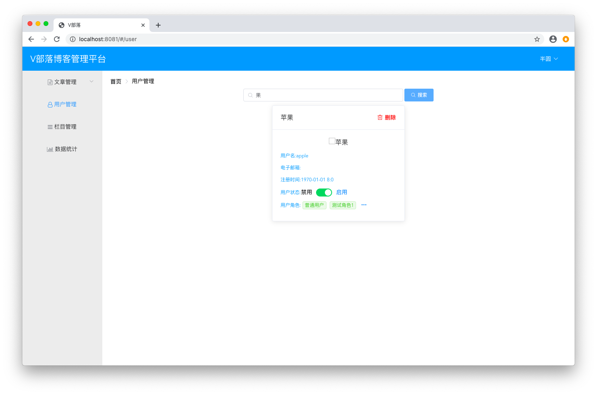

# 用户管理

## 代码

### 新建UserDto.java
```java
package club.banyuan.blog.dto;

import java.util.List;

public class UserDto extends UserBaseDto {

	private List<RoleDto> roles;

	public List<RoleDto> getRoles() {
		return roles;
	}

	public void setRoles(List<RoleDto> roles) {
		this.roles = roles;
	}
	
}
```

### 改造UserMapper.java
```java
public List<UserEntity> getUserByNickname(@Param("nickname") String nickname);
	
public int updateUserEnabled(@Param("uid") Long uid, @Param("enabled") Boolean enabled);
	
public int deleteUserRolesByUid(Long id);
	
public int setUserRoles(@Param("id") Long id, @Param("rids") Long[] rids);
```

### 改造UserMapper.xml
```xml
<select id="getUserByNickname" resultMap="BaseResultMap">
    select u.id, u.username, u.nickname, u.enabled, u.email, u.userface, u.regTime,
		   r.id as rid, r.name as rname
    from user u, roles r, roles_user ru
	where u.id = ru.uid and r.id = ru.rid and u.id not in
    	(select u2.id from user u2, roles_user ru2 where u2.id = ru2.uid and ru2.rid = 1)
    <choose>
    	<when test="nickname!=null and nickname!=''">
    		and u.nickname like concat('%',#{nickname},'%') order by u.id
		</when>
    	<otherwise>
    		order by u.id limit 20
    	</otherwise>
    </choose>
</select>
    
<update id="updateUserEnabled">
    update user set enabled = #{enabled} where id = #{uid}
</update>
    
<delete id="deleteUserRolesByUid">
    delete from roles_user where uid = #{id}
</delete>
    
<insert id="setUserRoles">
    insert into roles_user(rid, uid) values
    <foreach collection="rids" separator="," item="rid">
    	(#{rid}, #{id})
    </foreach>
</insert>
```

### 改造RoleMapper.java
```java
List<RoleEntity> getAllRole();
```

### 改造RoleMapper.xml
```xml
<select id="getAllRole" resultType="club.banyuan.blog.entity.RoleEntity">
	select id, name from roles
</select>
```

### 改造UserService.java
```java
public List<UserDto> getUserByNickname(String nickname);
public List<RoleDto> getAllRole();
public boolean updateUserEnabled(Long uid, Boolean enabled);
public boolean updateUserRoles(Long id, Long[] rids);
```

### 改造UserServiceImpl.java
```java
package club.banyuan.blog.service.impl;

import java.util.ArrayList;
import java.util.List;

import org.springframework.beans.BeanUtils;
import org.springframework.beans.factory.annotation.Autowired;
import org.springframework.stereotype.Service;
import org.springframework.transaction.annotation.Transactional;

import club.banyuan.blog.dto.RoleDto;
import club.banyuan.blog.dto.UserBaseDto;
import club.banyuan.blog.dto.UserDto;
import club.banyuan.blog.entity.RoleEntity;
import club.banyuan.blog.entity.UserEntity;
import club.banyuan.blog.mapper.RoleMapper;
import club.banyuan.blog.mapper.UserMapper;
import club.banyuan.blog.service.UserService;
import club.banyuan.blog.utils.UserUtil;

@Service
public class UserServiceImpl implements UserService {

	@Autowired
	private UserMapper userMapper;
	
	@Autowired
	private RoleMapper roleMapper;

	@Override
	public UserBaseDto getUserBaseInfoById() {
		UserEntity userEntity = userMapper.getUserById(UserUtil.getCurrentUser().getId());
		UserBaseDto userBaseDto = new UserBaseDto();
		if (userEntity != null) {
			BeanUtils.copyProperties(userEntity, userBaseDto);
		}
		return userBaseDto;
	}

	@Override
	public boolean updateUserEmail(String email) {
		return userMapper.updateUserEmail(UserUtil.getCurrentUser().getId(), email) > 0;
	}

	@Override
	public List<UserDto> getUserByNickname(String nickname) {
		List<UserEntity> userEntities = userMapper.getUserByNickname(nickname);
		List<UserDto> userDtos = new ArrayList<UserDto>();
		if (userEntities != null) {
			for (UserEntity userEntity : userEntities) {
				UserDto userDto = new UserDto();
				BeanUtils.copyProperties(userEntity, userDto);
				userDtos.add(userDto);
			}
		}
		return userDtos;
	}

	@Override
	public List<RoleDto> getAllRole() {
		List<RoleEntity> roleEntities = roleMapper.getAllRole();
		List<RoleDto> roleDtos = new ArrayList<RoleDto>();
		if (roleEntities != null) {
			for (RoleEntity roleEntity : roleEntities) {
				RoleDto roleDto = new RoleDto();
				BeanUtils.copyProperties(roleEntity, roleDto);
				roleDtos.add(roleDto);
			}
		}
		return roleDtos;
	}

	@Override
	@Transactional(rollbackFor = Exception.class)
	public boolean updateUserEnabled(Long uid, Boolean enabled) {
		return userMapper.updateUserEnabled(uid, enabled) > 0;
	}

	@Override
	@Transactional(rollbackFor = Exception.class)
	public boolean updateUserRoles(Long id, Long[] rids) {
		userMapper.deleteUserRolesByUid(id);
		boolean result = userMapper.setUserRoles(id, rids) > 0;
		return result;
	}

}
```

### 新建UserManageController.java
```java
package club.banyuan.blog.controller;

import java.util.List;

import org.springframework.beans.factory.annotation.Autowired;
import org.springframework.web.bind.annotation.PathVariable;
import org.springframework.web.bind.annotation.RequestMapping;
import org.springframework.web.bind.annotation.RequestMethod;
import org.springframework.web.bind.annotation.RestController;

import club.banyuan.blog.dto.Result;
import club.banyuan.blog.dto.RoleDto;
import club.banyuan.blog.dto.UserDto;
import club.banyuan.blog.service.UserService;

@RestController
@RequestMapping("/admin")
public class UserManageController {

	@Autowired
	private UserService userService;
	
	@RequestMapping(value = "/user", method = RequestMethod.GET)
	public List<UserDto> getUserByNickname(String nickname) {
		return userService.getUserByNickname(nickname);
	}
	
	@RequestMapping(value = "/roles", method = RequestMethod.GET)
	public List<RoleDto> getAllRole() {
		return userService.getAllRole();
	}
	
	@RequestMapping(value = "/user/enabled", method = RequestMethod.PUT)
	public Result updateUserEnabled(Long uid, Boolean enabled) {
		boolean result = userService.updateUserEnabled(uid, enabled);
		if (result) {
			return new Result("success", "更新成功!");
		}
		return new Result("error", "更新失败!");
	}
	
	@RequestMapping(value = "/user/role", method = RequestMethod.PUT)
	public Result updateUserRoles(Long id, Long[] rids) {
		boolean result = userService.updateUserRoles(id, rids);
		if (result) {
			return new Result("success", "更新成功!");
		}
		return new Result("error", "更新失败!");
	}
	
	@RequestMapping(value = "/user/{uid}", method = RequestMethod.DELETE)
	public Result deleteUserById(@PathVariable Long uid) {
		// 这里暂时和启用禁用方法一致
		boolean result = userService.updateUserEnabled(uid, false);
		if (result) {
			return new Result("success", "删除成功!");
		}
		return new Result("error", "删除失败!");
	}
}
```

### 数据库
新增两条用户数据
```
INSERT INTO `user`(username, nickname, `password`, enabled) VALUES ('guest', '游客', '202cb962ac59075b964b07152d234b70', '1');
INSERT INTO `user`(username, nickname, `password`, enabled) VALUES ('apple', '苹果', '202cb962ac59075b964b07152d234b70', '1');
```

给用户分配初始角色
```
INSERT INTO `roles_user`(uid) VALUES ('2');
INSERT INTO `roles_user`(uid) VALUES ('3');
```

数据结果如下 <br/>




## 启动

在用户管理页可以看到新增的两条数据 <br/>


点击用户角色旁边的三个点可以看到权限列表 <br/>


修改其中一个用户的角色，新增一直角色 <br/>


修改成功 <br/>


查询数据库中用户对应角色结果如下 <br/>


试一下搜索功能 <br/>




## 练习
写一个 POST 方法注册用户 <br/>
入参是 username nickname <br/>
创建的结果是给该用户分配默认的普通用户角色 <br/>
可以使用 username 进行登录 <br/>
使用 postman 进行调用 <br/>
