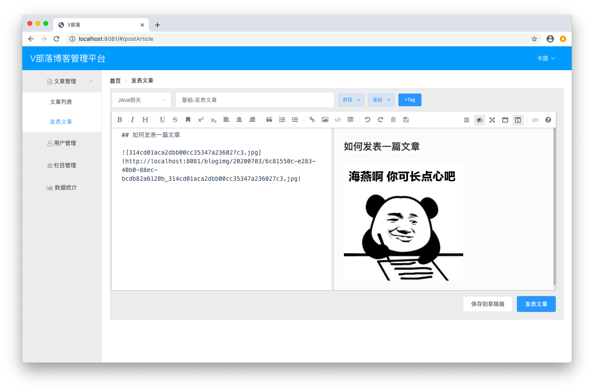
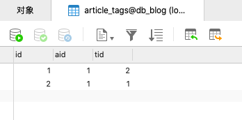

# 发表文章

## 代码

### 新建TagEntity.java
```java
package club.banyuan.blog.entity;

import java.io.Serializable;

public class TagEntity implements Serializable {

	/**
	 * 
	 */
	private static final long serialVersionUID = 1L;
	
	private Long id;
    private String tagName;

	public Long getId() {
		return id;
	}
	public void setId(Long id) {
		this.id = id;
	}
	public String getTagName() {
		return tagName;
	}
	public void setTagName(String tagName) {
		this.tagName = tagName;
	}
    
}
```

### 新建TagDto.java
```java
package club.banyuan.blog.dto;

public class TagDto {

	private Long id;
    private String tagName;

	public Long getId() {
		return id;
	}
	public void setId(Long id) {
		this.id = id;
	}
	public String getTagName() {
		return tagName;
	}
	public void setTagName(String tagName) {
		this.tagName = tagName;
	}

}
```

### 新建TagMapper.java
```java
package club.banyuan.blog.mapper;

import java.util.List;

import org.apache.ibatis.annotations.Param;

public interface TagMapper {

	public int deleteTagsByAid(Long aid);
	public int savetags(@Param("tags") String[] tags);
	public List<Long> getTagIdsByTagNames(@Param("tagNames") String[] tagNames);
	public int saveTags2ArticleTags(@Param("tagIds") List<Long> tagIds, @Param("aid") Long aid);

}
```

### 新建TagMapper.xml
```xml
<?xml version="1.0" encoding="UTF-8"?>
<!DOCTYPE mapper PUBLIC "-//mybatis.org//DTD Mapper 3.0//EN" "http://mybatis.org/dtd/mybatis-3-mapper.dtd">
<mapper namespace="club.banyuan.blog.mapper.TagMapper">
	<delete id="deleteTagsByAid" parameterType="Long">
		delete from article_tags where aid = #{aid}
	</delete>
	
	<insert id="savetags">
		insert ignore into tags(tagName) values
		<foreach collection="tags" item="tag" separator=",">
			(#{tag})
		</foreach>
	</insert>
	
	<select id="getTagIdsByTagNames" resultType="long">
		select id from tags
		where tagName in
		<foreach collection="tagNames" item="tagName" separator="," open="(" close=")">
			#{tagName}
		</foreach>
	</select>
	
	<insert id="saveTags2ArticleTags">
		insert into article_tags(aid, tid) values
		<foreach collection="tagIds" item="tagId" separator=",">
			(#{aid}, #{tagId})
		</foreach>
	</insert>
</mapper>
```

### 新建ArticleEntity.java
```java
package club.banyuan.blog.entity;

import java.io.Serializable;
import java.sql.Timestamp;
import java.util.List;

public class ArticleEntity implements Serializable {

	/**
	 * 
	 */
	private static final long serialVersionUID = 1L;

	private Long id;
    private String title;
    private String mdContent;
    private String htmlContent;
    private String summary;
    private Long cid;
    private Long uid;
    private Timestamp publishDate;
    private Timestamp editTime;
    private Integer state;
    private Integer pageView;
    private String nickname;
    private String cateName;
    private List<TagEntity> tags;

	public Long getId() {
		return id;
	}
	public void setId(Long id) {
		this.id = id;
	}
	public String getTitle() {
		return title;
	}
	public void setTitle(String title) {
		this.title = title;
	}
	public String getMdContent() {
		return mdContent;
	}
	public void setMdContent(String mdContent) {
		this.mdContent = mdContent;
	}
	public String getHtmlContent() {
		return htmlContent;
	}
	public void setHtmlContent(String htmlContent) {
		this.htmlContent = htmlContent;
	}
	public String getSummary() {
		return summary;
	}
	public void setSummary(String summary) {
		this.summary = summary;
	}
	public Long getCid() {
		return cid;
	}
	public void setCid(Long cid) {
		this.cid = cid;
	}
	public Long getUid() {
		return uid;
	}
	public void setUid(Long uid) {
		this.uid = uid;
	}
	public Timestamp getPublishDate() {
		return publishDate;
	}
	public void setPublishDate(Timestamp publishDate) {
		this.publishDate = publishDate;
	}
	public Timestamp getEditTime() {
		return editTime;
	}
	public void setEditTime(Timestamp editTime) {
		this.editTime = editTime;
	}
	public Integer getState() {
		return state;
	}
	public void setState(Integer state) {
		this.state = state;
	}
	public Integer getPageView() {
		return pageView;
	}
	public void setPageView(Integer pageView) {
		this.pageView = pageView;
	}
	public String getNickname() {
		return nickname;
	}
	public void setNickname(String nickname) {
		this.nickname = nickname;
	}
	public String getCateName() {
		return cateName;
	}
	public void setCateName(String cateName) {
		this.cateName = cateName;
	}
	public List<TagEntity> getTags() {
		return tags;
	}
	public void setTags(List<TagEntity> tags) {
		this.tags = tags;
	}
    
}
```

### 新建ArticleDto.java
```java
package club.banyuan.blog.dto;

import java.sql.Timestamp;
import java.util.List;

import club.banyuan.blog.entity.TagEntity;

public class ArticleDto {

	private Long id;
    private String title;
    private String mdContent;
    private String htmlContent;
    private String summary;
    private Long cid;
    private Long uid;
    private Timestamp publishDate;
    private Timestamp editTime;
    private Integer state;
    private Integer pageView;
    private String nickname;
    private String cateName;
    private List<TagEntity> tags;
    private String[] dynamicTags;

	public Long getId() {
		return id;
	}
	public void setId(Long id) {
		this.id = id;
	}
	public String getTitle() {
		return title;
	}
	public void setTitle(String title) {
		this.title = title;
	}
	public String getMdContent() {
		return mdContent;
	}
	public void setMdContent(String mdContent) {
		this.mdContent = mdContent;
	}
	public String getHtmlContent() {
		return htmlContent;
	}
	public void setHtmlContent(String htmlContent) {
		this.htmlContent = htmlContent;
	}
	public String getSummary() {
		return summary;
	}
	public void setSummary(String summary) {
		this.summary = summary;
	}
	public Long getCid() {
		return cid;
	}
	public void setCid(Long cid) {
		this.cid = cid;
	}
	public Long getUid() {
		return uid;
	}
	public void setUid(Long uid) {
		this.uid = uid;
	}
	public Timestamp getPublishDate() {
		return publishDate;
	}
	public void setPublishDate(Timestamp publishDate) {
		this.publishDate = publishDate;
	}
	public Timestamp getEditTime() {
		return editTime;
	}
	public void setEditTime(Timestamp editTime) {
		this.editTime = editTime;
	}
	public Integer getState() {
		return state;
	}
	public void setState(Integer state) {
		this.state = state;
	}
	public Integer getPageView() {
		return pageView;
	}
	public void setPageView(Integer pageView) {
		this.pageView = pageView;
	}
	public String getNickname() {
		return nickname;
	}
	public void setNickname(String nickname) {
		this.nickname = nickname;
	}
	public String getCateName() {
		return cateName;
	}
	public void setCateName(String cateName) {
		this.cateName = cateName;
	}
	public List<TagEntity> getTags() {
		return tags;
	}
	public void setTags(List<TagEntity> tags) {
		this.tags = tags;
	}
	public String[] getDynamicTags() {
		return dynamicTags;
	}
	public void setDynamicTags(String[] dynamicTags) {
		this.dynamicTags = dynamicTags;
	}
    
}
```

### 新建ArticleMapper.java
```java
package club.banyuan.blog.mapper;

import club.banyuan.blog.entity.ArticleEntity;

public interface ArticleMapper {

	public int addNewArticle(ArticleEntity article);
	public int updateArticle(ArticleEntity article);
}
```

### 新建ArticleMapper.xml
```xml
<?xml version="1.0" encoding="UTF-8"?>
<!DOCTYPE mapper PUBLIC "-//mybatis.org//DTD Mapper 3.0//EN" "http://mybatis.org/dtd/mybatis-3-mapper.dtd">
<mapper namespace="club.banyuan.blog.mapper.ArticleMapper">
	<insert id="addNewArticle"
		parameterType="club.banyuan.blog.entity.ArticleEntity"
		useGeneratedKeys="true" keyProperty="id">
		insert into article
		set title = #{title}, mdContent = #{mdContent}, htmlContent = #{htmlContent},
			summary = #{summary}, cid = #{cid}, uid = #{uid}, state=#{state},
			publishDate = #{publishDate}, editTime=#{editTime} 
	</insert>
	<update id="updateArticle" parameterType="club.banyuan.blog.entity.ArticleEntity">
		update article
		set title = #{title}, mdContent = #{mdContent}, htmlContent = #{htmlContent},
			summary = #{summary}, cid = #{cid}, editTime = #{editTime}
		<if test="state == 1">
            ,state = 1
        </if>
        <if test="publishDate != null">
            ,publishDate = #{publishDate}
        </if>
        where id = #{id}
	</update>
</mapper>
```

### 新建ArticleService.java
```java
package club.banyuan.blog.service;

import club.banyuan.blog.dto.ArticleDto;

public interface ArticleService {

	public boolean addNewArticle(ArticleDto article);
}
```

### 新建ArticleServiceImpl.java
```java
package club.banyuan.blog.service.impl;

import java.sql.Timestamp;
import java.util.List;

import org.springframework.beans.BeanUtils;
import org.springframework.beans.factory.annotation.Autowired;
import org.springframework.stereotype.Service;
import org.springframework.transaction.annotation.Transactional;

import club.banyuan.blog.dto.ArticleDto;
import club.banyuan.blog.entity.ArticleEntity;
import club.banyuan.blog.mapper.ArticleMapper;
import club.banyuan.blog.mapper.TagMapper;
import club.banyuan.blog.service.ArticleService;
import club.banyuan.blog.utils.UserUtil;

@Service
public class ArticleServiceImpl implements ArticleService {

	@Autowired
	private ArticleMapper articleMapper;
	
	@Autowired
	private TagMapper tagMapper;
	
	@Override
	@Transactional(rollbackFor = Exception.class)
	public boolean addNewArticle(ArticleDto article) {
		ArticleEntity articleEntity = new ArticleEntity();
		BeanUtils.copyProperties(article, articleEntity);
		if (article.getSummary() == null || "".equals(article.getSummary())) {
			String content = stripHtml(article.getHtmlContent());
			int end = content.length() > 50 ? 50 : content.length();
			articleEntity.setSummary(content.substring(0, end));
		}
		Timestamp now = new Timestamp(System.currentTimeMillis());
		if (article.getState() == 1) {
			articleEntity.setPublishDate(now);
		}
		articleEntity.setEditTime(now);
		String[] dynamicTags = article.getDynamicTags();
		
		boolean result = false;
		
		if (articleEntity.getId() == null || articleEntity.getId() == -1) {
			articleEntity.setUid(UserUtil.getCurrentUser().getId());
			result = articleMapper.addNewArticle(articleEntity) > 0;
			article.setId(articleEntity.getId());
		} else {
			result = articleMapper.updateArticle(articleEntity) > 0;
		}
		
		// 处理标签
		if (!addTagsToArticle(dynamicTags, articleEntity.getId())) {
			return false;
		}
		
		return result;
	}
	
	private boolean addTagsToArticle(String[] dynamicTags, Long aid) {
		tagMapper.deleteTagsByAid(aid);
		if (dynamicTags.length > 0) {
			tagMapper.savetags(dynamicTags);
			List<Long> tagIds = tagMapper.getTagIdsByTagNames(dynamicTags);
			boolean result = tagMapper.saveTags2ArticleTags(tagIds, aid) == dynamicTags.length;
			return result;
		}
		return true;
	}
	
	public String stripHtml(String content) {
		content = content.replaceAll("<p .*?>", ""); 
		content = content.replaceAll("<br\\s*/?>", ""); 
		content = content.replaceAll("\\<.*?>", ""); 
		return content;
	}

}
```

### 添加依赖

```
<dependency>
	<groupId>commons-io</groupId>
	<artifactId>commons-io</artifactId>
	<version>2.4</version>
</dependency>
```

### 新建ArticleController.java
```java
package club.banyuan.blog.controller;

import java.io.File;
import java.io.FileOutputStream;
import java.text.SimpleDateFormat;
import java.util.Date;
import java.util.UUID;

import javax.servlet.http.HttpServletRequest;

import org.apache.commons.io.IOUtils;
import org.springframework.beans.factory.annotation.Autowired;
import org.springframework.web.bind.annotation.RequestMapping;
import org.springframework.web.bind.annotation.RequestMethod;
import org.springframework.web.bind.annotation.RestController;
import org.springframework.web.multipart.MultipartFile;

import club.banyuan.blog.dto.ArticleDto;
import club.banyuan.blog.dto.Result;
import club.banyuan.blog.service.ArticleService;

@RestController
@RequestMapping("/article")
public class ArticleController {
	
	private SimpleDateFormat sdf = new SimpleDateFormat("yyyyMMdd");

	@Autowired
	private ArticleService articleService;
	
	@RequestMapping(value = "/", method = RequestMethod.POST)
	public Result addNewArticle(ArticleDto article) {
		boolean result = articleService.addNewArticle(article);
		if (result) {
			return new Result("success", article.getId() + "");
		} else {
			return new Result("error", article.getState() == 0 ? "文章保存失败!" : "文章发表失败!");
		}
	}
	
	@RequestMapping(value = "/uploadimg", method = RequestMethod.POST)
	public Result uploadImg(HttpServletRequest request, MultipartFile image) {
		StringBuffer url = new StringBuffer();
		String filePath = "/blogimg/" + sdf.format(new Date());
		String imgFolderPath = request.getServletContext().getRealPath(filePath);
		File imgFolder = new File(imgFolderPath);
		if (!imgFolder.exists()) {
			imgFolder.mkdirs();
		}
		url.append(request.getScheme())
			.append("://")
			.append(request.getServerName())
			.append(":")
			.append(request.getServerPort())
			.append(request.getContextPath())
			.append(filePath);
		String imgName = UUID.randomUUID() + "_" + image.getOriginalFilename().replaceAll(" ", "");
		try {
			IOUtils.write(image.getBytes(), new FileOutputStream(new File(imgFolder, imgName)));
			url.append("/").append(imgName);
			return new Result("success", url.toString());
		} catch (Exception e) {
			e.printStackTrace();
		}
		return new Result("error", "上传失败!");
	}
}
```

## 启动

进入发表文章界面 <br/>


选择上传图片测试一下图片上传是否正常 <br/>


可以看到图片上传成功并且正常显示 <br/>


填入标题和内容，选择一下分类，添加几个标签。保存到草稿 <br/>


由于查询接口还没写，目前保存会有报错提示，这里先从数据库中看一下保存结果情况 <br/>




## 练习
完成发表文章模块 <br/>
