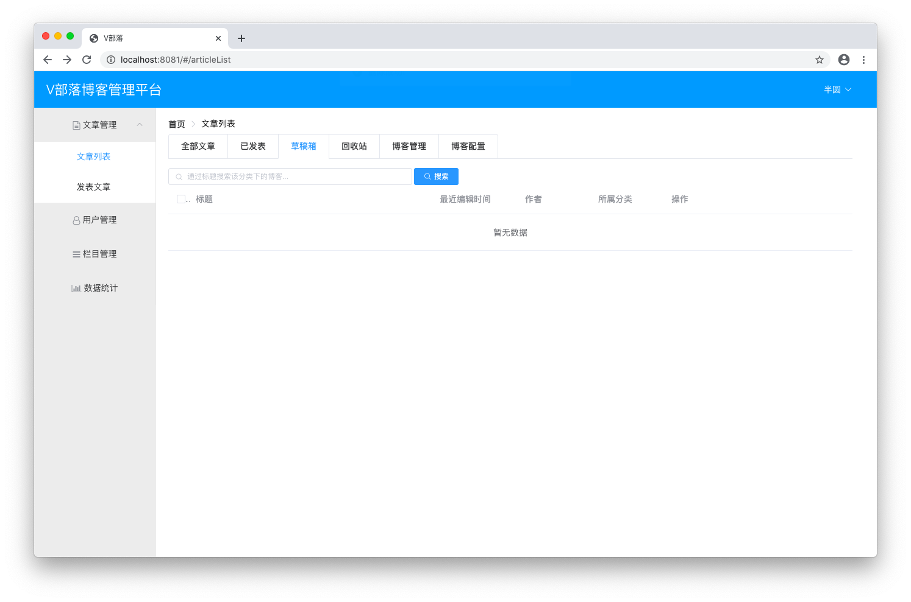

# 文章列表

## 代码

### 改造ArticleMapper.java
```java
package club.banyuan.blog.mapper;

import java.util.List;

import org.apache.ibatis.annotations.Param;

import club.banyuan.blog.entity.ArticleEntity;

public interface ArticleMapper {

	public int addNewArticle(ArticleEntity article);

	public int updateArticle(ArticleEntity article);

	public List<ArticleEntity> getArticleByState(
			@Param("state") Integer state, 
			@Param("start") Integer start,
			@Param("count") Integer count, 
			@Param("uid") Long uid, 
			@Param("keywords") String keywords);

	int getArticleCountByState(
			@Param("state") Integer state,
			@Param("uid") Long uid,
			@Param("keywords") String keywords);

	public int deleteArticleById(@Param("aids") Long[] aids);

	int updateArticleState(@Param("aids") Long[] aids, @Param("state") Integer state);

	public ArticleEntity getArticleById(Long aid);

	public void pvIncrement(Long aid);
}
```

### 改造ArticleMapper.xml
```xml
<?xml version="1.0" encoding="UTF-8"?>
<!DOCTYPE mapper PUBLIC "-//mybatis.org//DTD Mapper 3.0//EN" "http://mybatis.org/dtd/mybatis-3-mapper.dtd">
<mapper namespace="club.banyuan.blog.mapper.ArticleMapper">
	<insert id="addNewArticle"
		parameterType="club.banyuan.blog.entity.ArticleEntity"
		useGeneratedKeys="true" keyProperty="id">
		insert into article
		set title = #{title}, mdContent = #{mdContent}, htmlContent = #{htmlContent},
			summary = #{summary}, cid = #{cid}, uid = #{uid}, state=#{state},
			publishDate = #{publishDate}, editTime=#{editTime} 
	</insert>
	<update id="updateArticle" parameterType="club.banyuan.blog.entity.ArticleEntity">
		update article
		set title = #{title}, mdContent = #{mdContent}, htmlContent = #{htmlContent},
			summary = #{summary}, cid = #{cid}, editTime = #{editTime}
		<if test="state == 1">
            ,state = 1
        </if>
        <if test="publishDate != null">
            ,publishDate = #{publishDate}
        </if>
        where id = #{id}
	</update>
	
	<select id="getArticleByState" resultType="club.banyuan.blog.entity.ArticleEntity">
		select a.id, a.title, a.editTime, a.pageView, a.state, a.uid, u.nickname, c.cateName
		from article a, user u, category c
		where a.cid = c.id and a.uid = u.id
		<if test="state != -2">
			and a.uid = #{uid}
		</if>
		<if test="state != -1 and state != -2">
			and a.state = #{state}
		</if>
		<if test="state == -2">
			and a.state = 1
		</if>
		<if test="keywords != null">
			and a.title like concat('%', #{keywords}, '%')
		</if>
		order by a.editTime desc limit #{start}, #{count}
	</select>
	<select id="getArticleCountByState" resultType="int">
		select count(*) from article
		<where>
			<if test="state != -1">
				and state = #{state}
			</if>
			<if test="uid != null">
				and uid = #{uid}
			</if>
			<if test="keywords != null">
				and title like concat('%', #{keywords}, '%')
			</if>
		</where>
	</select>
	<delete id="deleteArticleById">
		delete from article where id in
		<foreach collection="aids" item="aid" open="(" close=")" separator=",">
			#{aid}
		</foreach>
	</delete>
	<update id="updateArticleState">
		update article set state = #{state} where id in
		<foreach collection="aids" item="aid" open="(" close=")" separator=",">
			#{aid}
		</foreach>
	</update>
	
	<resultMap id="BaseResultMap" type="club.banyuan.blog.entity.ArticleEntity">
		<id column="id" property="id"/>
		<result column="title" property="title"/>
        <result column="cid" property="cid"/>
        <result column="uid" property="uid"/>
        <result column="publishDate" property="publishDate"/>
        <result column="editTime" property="editTime"/>
        <result column="state" property="state"/>
        <result column="pageView" property="pageView"/>
        <result column="mdContent" property="mdContent"/>
        <result column="htmlContent" property="htmlContent"/>
        <result column="summary" property="summary"/>
        <result column="nickname" property="nickname"/>
        <result column="cateName" property="cateName"/>
        <collection property="tags" ofType="club.banyuan.blog.entity.TagEntity" column="tagName">
            <id property="id" column="tid"/>
            <result property="tagName" column="tagName"/>
        </collection>
	</resultMap>
	
	<select id="getArticleById" parameterType="Long" resultMap="BaseResultMap">
		select a.id, a.title, a.cid, a.uid, a.publishDate, a.editTime, a.state,
			   a.pageView, a.mdContent, a.htmlContent, a.summary,
			   u.nickname, c.cateName, t.id as tid, t.tagName
		from article a 
			left join article_tags ats on a.id = ats.aid
			left join tags t on ats.tid = t.id
			left join user u on a.uid = u.id
			left join category c on a.cid = c.id
		where a.id = #{aid}
	</select>
	
	<update id="pvIncrement" parameterType="Long">
		update article set pageView = pageView + 1 where id = #{aid}
	</update>
</mapper>
```

### 改造ArticleService.java
```java
package club.banyuan.blog.service;

import java.util.List;

import club.banyuan.blog.dto.ArticleDto;

public interface ArticleService {

	public boolean addNewArticle(ArticleDto article);
	
	public List<ArticleDto> getArticleByState(Integer state, Integer page, Integer count, String keywords);
	
	public int getArticleCountByState(Integer state, Long uid, String keywords);
	
	public boolean updateArticleState(Long[] aids, Integer state);
	
	public ArticleDto getArticleById(Long aid);
}
```

### 改造ArticleServiceImpl.java
```java
package club.banyuan.blog.service.impl;

import java.sql.Timestamp;
import java.util.ArrayList;
import java.util.List;

import org.springframework.beans.BeanUtils;
import org.springframework.beans.factory.annotation.Autowired;
import org.springframework.stereotype.Service;
import org.springframework.transaction.annotation.Transactional;

import club.banyuan.blog.dto.ArticleDto;
import club.banyuan.blog.entity.ArticleEntity;
import club.banyuan.blog.mapper.ArticleMapper;
import club.banyuan.blog.mapper.TagMapper;
import club.banyuan.blog.service.ArticleService;
import club.banyuan.blog.utils.UserUtil;

@Service
public class ArticleServiceImpl implements ArticleService {

	@Autowired
	private ArticleMapper articleMapper;
	
	@Autowired
	private TagMapper tagMapper;
	
	@Override
	@Transactional(rollbackFor = Exception.class)
	public boolean addNewArticle(ArticleDto article) {
		ArticleEntity articleEntity = new ArticleEntity();
		BeanUtils.copyProperties(article, articleEntity);
		if (article.getSummary() == null || "".equals(article.getSummary())) {
			String content = stripHtml(article.getHtmlContent());
			int end = content.length() > 50 ? 50 : content.length();
			articleEntity.setSummary(content.substring(0, end));
		}
		Timestamp now = new Timestamp(System.currentTimeMillis());
		if (article.getState() == 1) {
			articleEntity.setPublishDate(now);
		}
		articleEntity.setEditTime(now);
		String[] dynamicTags = article.getDynamicTags();
		
		boolean result = false;
		
		if (articleEntity.getId() == null || articleEntity.getId() == -1) {
			articleEntity.setUid(UserUtil.getCurrentUser().getId());
			result = articleMapper.addNewArticle(articleEntity) > 0;
			article.setId(articleEntity.getId());
		} else {
			result = articleMapper.updateArticle(articleEntity) > 0;
		}
		
		// 处理标签
		if (!addTagsToArticle(dynamicTags, articleEntity.getId())) {
			return false;
		}
		
		return result;
	}
	
	private boolean addTagsToArticle(String[] dynamicTags, Long aid) {
		tagMapper.deleteTagsByAid(aid);
		if (dynamicTags.length > 0) {
			tagMapper.savetags(dynamicTags);
			List<Long> tagIds = tagMapper.getTagIdsByTagNames(dynamicTags);
			boolean result = tagMapper.saveTags2ArticleTags(tagIds, aid) == dynamicTags.length;
			return result;
		}
		return true;
	}
	
	public String stripHtml(String content) {
		content = content.replaceAll("<p .*?>", ""); 
		content = content.replaceAll("<br\\s*/?>", ""); 
		content = content.replaceAll("\\<.*?>", ""); 
		return content;
	}

	@Override
	public List<ArticleDto> getArticleByState(Integer state, Integer page, Integer count, String keywords) {
		int start = (page - 1) * count;
		Long uid = UserUtil.getCurrentUser().getId();
		List<ArticleEntity> articleEntities = articleMapper.getArticleByState(state, start, count, uid, keywords);
		List<ArticleDto> articleDtos = new ArrayList<ArticleDto>();
		for (ArticleEntity articleEntity : articleEntities) {
			ArticleDto articleDto = new ArticleDto();
			BeanUtils.copyProperties(articleEntity, articleDto);
			articleDtos.add(articleDto);
		}
		return articleDtos;
	}

	@Override
	public int getArticleCountByState(Integer state, Long uid, String keywords) {
		return articleMapper.getArticleCountByState(state, uid, keywords);
	}

	@Override
	public boolean updateArticleState(Long[] aids, Integer state) {
		if (state == 2) {
			return articleMapper.deleteArticleById(aids) > 0;
		} else {
			return articleMapper.updateArticleState(aids, 2) > 0;
		}
	}

	@Override
	public ArticleDto getArticleById(Long aid) {
		// 根据ID获取文章
		ArticleEntity articleEntity = articleMapper.getArticleById(aid);
		ArticleDto articleDto = new ArticleDto();
		BeanUtils.copyProperties(articleEntity, articleDto);
		// 浏览量 +1
		articleMapper.pvIncrement(aid);
		return articleDto;
	}

}
```

### 改造ArticleController.java
```java
package club.banyuan.blog.controller;

import java.io.File;
import java.io.FileOutputStream;
import java.text.SimpleDateFormat;
import java.util.Date;
import java.util.HashMap;
import java.util.List;
import java.util.Map;
import java.util.UUID;

import javax.servlet.http.HttpServletRequest;

import org.apache.commons.io.IOUtils;
import org.springframework.beans.factory.annotation.Autowired;
import org.springframework.web.bind.annotation.PathVariable;
import org.springframework.web.bind.annotation.RequestMapping;
import org.springframework.web.bind.annotation.RequestMethod;
import org.springframework.web.bind.annotation.RequestParam;
import org.springframework.web.bind.annotation.RestController;
import org.springframework.web.multipart.MultipartFile;

import club.banyuan.blog.dto.ArticleDto;
import club.banyuan.blog.dto.Result;
import club.banyuan.blog.service.ArticleService;
import club.banyuan.blog.utils.UserUtil;

@RestController
@RequestMapping("/article")
public class ArticleController {
	
	private SimpleDateFormat sdf = new SimpleDateFormat("yyyyMMdd");

	@Autowired
	private ArticleService articleService;
	
	@RequestMapping(value = "/", method = RequestMethod.POST)
	public Result addNewArticle(ArticleDto article) {
		boolean result = articleService.addNewArticle(article);
		if (result) {
			return new Result("success", article.getId() + "");
		} else {
			return new Result("error", article.getState() == 0 ? "文章保存失败!" : "文章发表失败!");
		}
	}
	
	@RequestMapping(value = "/uploadimg", method = RequestMethod.POST)
	public Result uploadImg(HttpServletRequest request, MultipartFile image) {
		StringBuffer url = new StringBuffer();
		String filePath = "/blogimg/" + sdf.format(new Date());
		String imgFolderPath = request.getServletContext().getRealPath(filePath);
		File imgFolder = new File(imgFolderPath);
		if (!imgFolder.exists()) {
			imgFolder.mkdirs();
		}
		url.append(request.getScheme())
			.append("://")
			.append(request.getServerName())
			.append(":")
			.append(request.getServerPort())
			.append(request.getContextPath())
			.append(filePath);
		String imgName = UUID.randomUUID() + "_" + image.getOriginalFilename().replaceAll(" ", "");
		try {
			IOUtils.write(image.getBytes(), new FileOutputStream(new File(imgFolder, imgName)));
			url.append("/").append(imgName);
			return new Result("success", url.toString());
		} catch (Exception e) {
			e.printStackTrace();
		}
		return new Result("error", "上传失败!");
	}
	
	@RequestMapping(value = "/all", method = RequestMethod.GET)
	public Map<String, Object> getArticleByState(
			@RequestParam(value = "state", defaultValue = "-1") Integer state,
			@RequestParam(value = "page", defaultValue = "1") Integer page,
			@RequestParam(value = "count", defaultValue = "6") Integer count,
			String keywords) {
		Long uid = UserUtil.getCurrentUser().getId();
		int totalCount = articleService.getArticleCountByState(state, uid, keywords);
		List<ArticleDto> articles = articleService.getArticleByState(state, page, count, keywords);
		Map<String, Object> map = new HashMap<String, Object>();
		map.put("totalCount", totalCount);
		map.put("articles", articles);
		return map;
	}
	
	@RequestMapping(value = "/{aid}", method = RequestMethod.GET)
	public ArticleDto getArticleById(@PathVariable Long aid) {
		return articleService.getArticleById(aid);
	}
	
	@RequestMapping(value = "/dustbin", method = RequestMethod.PUT)
	public Result updateArticleState(Long[] aids, Integer state) {
		boolean result = articleService.updateArticleState(aids, state);
		if (result) {
			return new Result("success", "删除成功!");
		}
		return new Result("error", "删除失败!");
	}
}
```

### 新建AdminController.java
```java
package club.banyuan.blog.controller;

import java.util.HashMap;
import java.util.List;
import java.util.Map;

import org.springframework.beans.factory.annotation.Autowired;
import org.springframework.web.bind.annotation.RequestMapping;
import org.springframework.web.bind.annotation.RequestMethod;
import org.springframework.web.bind.annotation.RequestParam;
import org.springframework.web.bind.annotation.RestController;

import club.banyuan.blog.dto.ArticleDto;
import club.banyuan.blog.dto.Result;
import club.banyuan.blog.service.ArticleService;

@RestController
@RequestMapping("/admin")
public class AdminController {

	@Autowired
	private ArticleService articleService;
	
	@RequestMapping(value = "/article/all", method = RequestMethod.GET)
	public Map<String, Object> getArticleByStateByAdmin(
			@RequestParam(value = "page", defaultValue = "1") Integer page,
			@RequestParam(value = "count", defaultValue = "6") Integer count,
			String keywords) {
		int totalCount = articleService.getArticleCountByState(1, null, keywords);
		List<ArticleDto> articles = articleService.getArticleByState(-2, page, count, keywords);
		Map<String, Object> map = new HashMap<>();
		map.put("totalCount", totalCount);
		map.put("articles", articles);
		return map;
	}

	@RequestMapping(value = "/article/dustbin", method = RequestMethod.PUT)
	public Result updateArticleState(Long[] aids, Integer state) {
		boolean result = articleService.updateArticleState(aids, state);
		if (result) {
			return new Result("success", "删除成功!");
		}
		return new Result("error", "删除失败!");
	}
}
```

## 启动

在发表文章里随便写点东西并发表 <br/>


查看文章列表 <br/>


删除一篇文章 <br/>





再写一篇文章进行查看 <br/>


返回再进来可以看到浏览 `+1` <br/>


## 练习
完成文章列表模块 <br/>
上传图片发表文章会出现程序重启后链接失效找不到图片的问题 <br/>
找出原因并解决 <br/>
