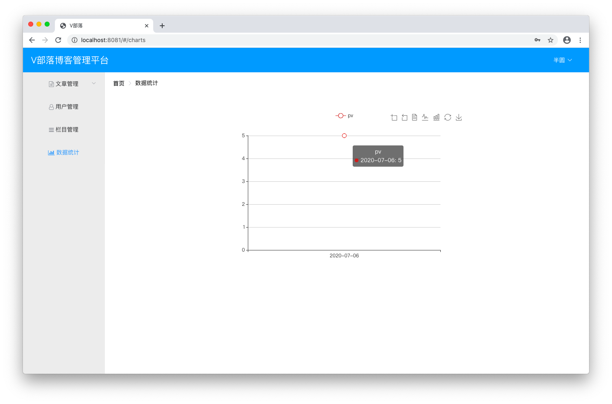

# 数据统计

## 代码

### 改造ArticleMapper.java
```java
public void pvIncrement(Long aid);
	
public void pvStatisticsPerDay();
	
public List<String> getCategories(Long uid);
	
public List<Integer> getDataStatistics(Long uid);
```

### 改造ArticleMapper.xml
```xml
<update id="pvIncrement" parameterType="Long">
	update article set pageView = pageView + 1 where id = #{aid}
</update>
	
<insert id="pvStatisticsPerDay">
	insert into pv(countDate,pv,uid)
	select CURRENT_DATE(), totalPv - IFNULL(pv,0) as pv, t.uid 
	from totalpvview t left join pvview p on t.uid = p.uid
	on duplicate key update
	pv.pv = pv.pv + values(pv)
</insert>
	
<select id="getCategories" parameterType="Long" resultType="String">
	select countDate from pv where uid = #{uid} order by countDate limit 7
</select>
	
<select id="getDataStatistics" parameterType="Long" resultType="int">
	select pv from pv where uid = #{uid} order by countDate limit 7
</select>
```

### 改造ArticleService.java
```java
public void pvStatisticsPerDay();
	
public List<String> getCategories();
	
public List<Integer> getDataStatistics();
```

### 改造ArticleServiceImpl.java
```java
@Override
public void pvStatisticsPerDay() {
	articleMapper.pvStatisticsPerDay();
}

@Override
public List<String> getCategories() {
	return articleMapper.getCategories(UserUtil.getCurrentUser().getId());
}

@Override
public List<Integer> getDataStatistics() {
	return articleMapper.getDataStatistics(UserUtil.getCurrentUser().getId());
}
```

### 改造ArticleController.java
```java
@RequestMapping("/dataStatistics")
public Map<String, Object> dataStatistics() {
	Map<String, Object> map = new HashMap<String, Object>();
	List<String> categories = articleService.getCategories();
	List<Integer> ds = articleService.getDataStatistics();
	map.put("categories", categories);
    map.put("ds", ds);
	return map;
}
```

### 新建DataStatisticsTask.java

在 `club.banyuan.blog.task` 下新建
```java
package club.banyuan.blog.task;

import org.springframework.beans.factory.annotation.Autowired;
import org.springframework.scheduling.annotation.Scheduled;
import org.springframework.stereotype.Component;

import club.banyuan.blog.service.ArticleService;

@Component
public class DataStatisticsTask {

	@Autowired
	private ArticleService articleService;
	
	@Scheduled(cron = "0 0/5 * * * ?")
	public void pvStatisticsPerDay() {
		// 每天0点触发 "1 0 0 * * ?"
		// 每5分钟触发 "0 0/5 * * * ?"
		articleService.pvStatisticsPerDay();
	}
}
```

### BlogApplication.java
```
@EnableScheduling
```

## 启动
数据统计需要数据支持才能看到对应的图表 <br/>
先把计划任务设置成每 5 分钟执行，可以看到今天的数据 <br/>


## 练习
当前系统下仅管理员角色可以在博客管理下看到所有人发布的文章 <br/>
全部文章下看到的是个人所有状态的文章 <br/>
改造一下接口逻辑，让全部文章下可以看到所有人已发布的文章 <br/>
