# 实战项目

## 界面预览

登录界面  
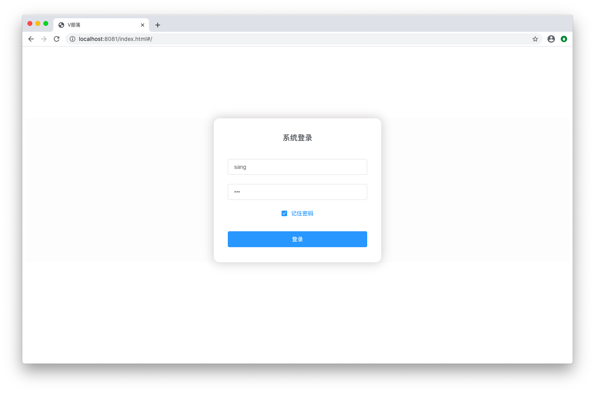

发表文章  
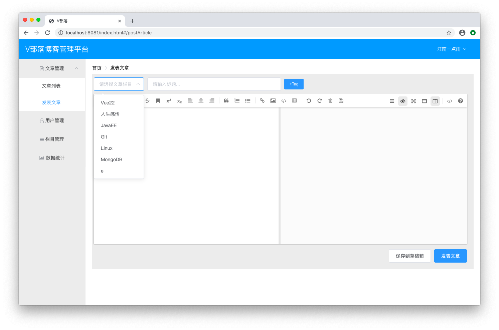

用户管理  
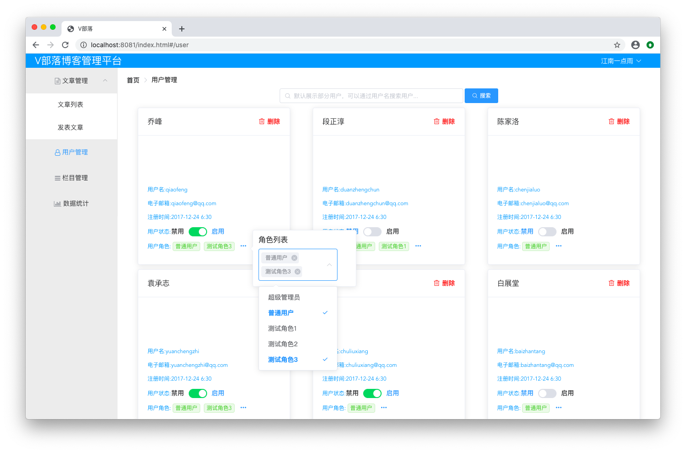

栏目管理  
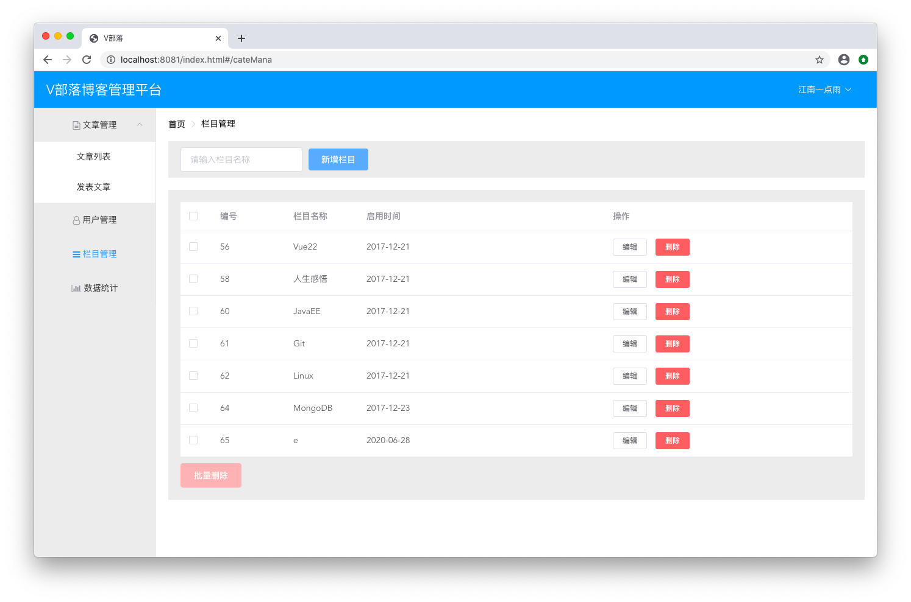

数据统计  
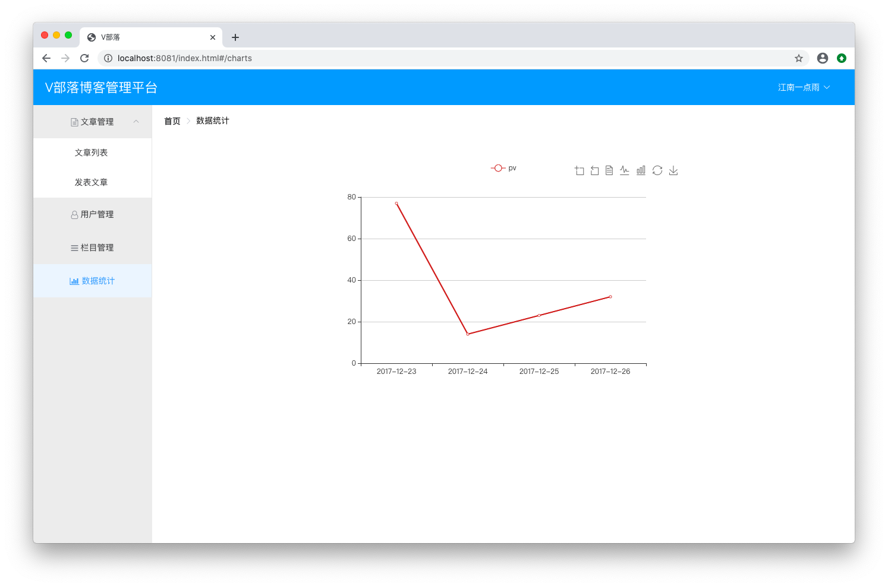

文章列表  
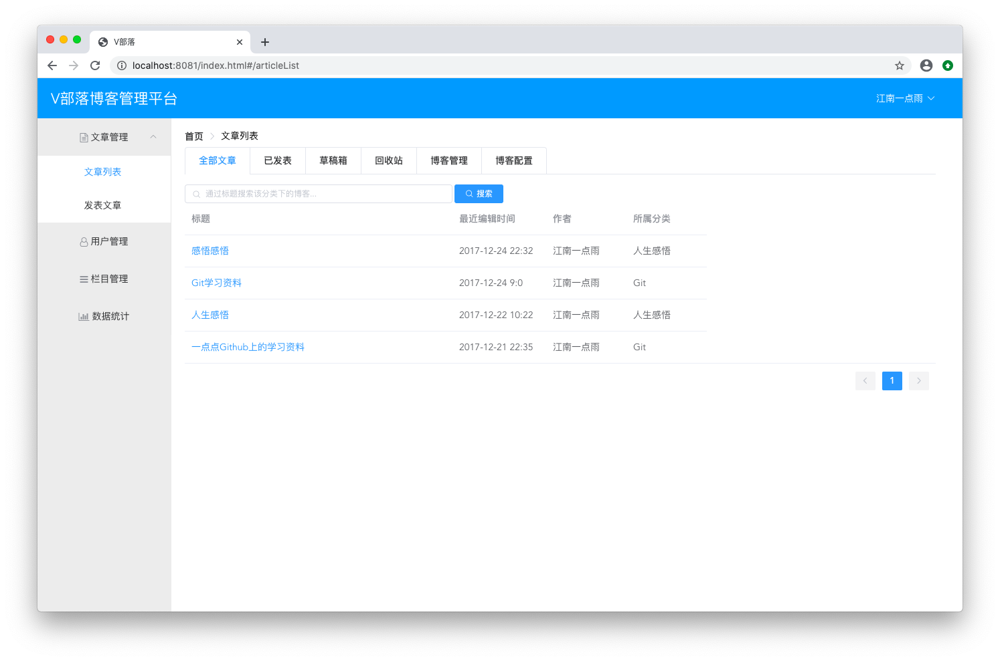

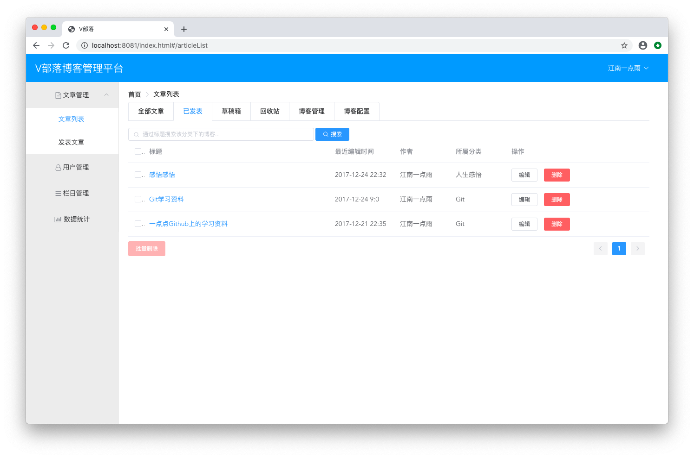

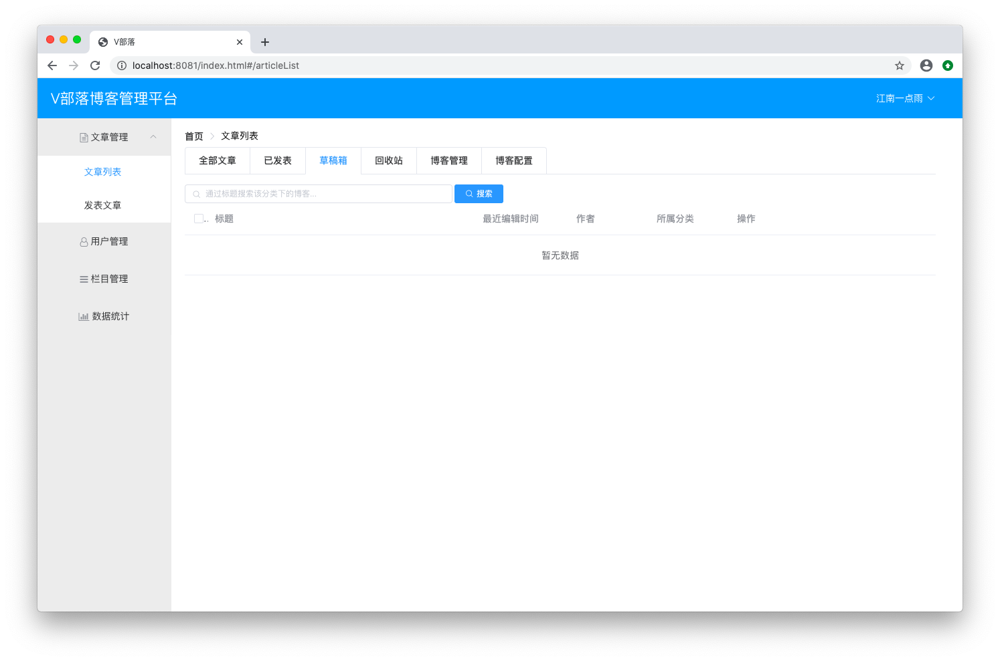

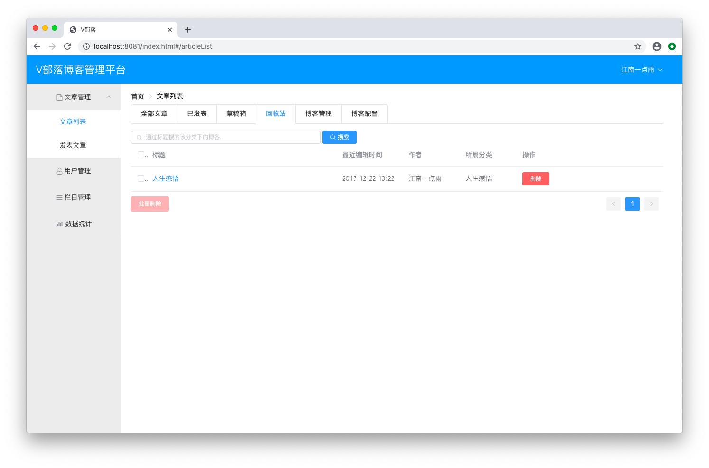

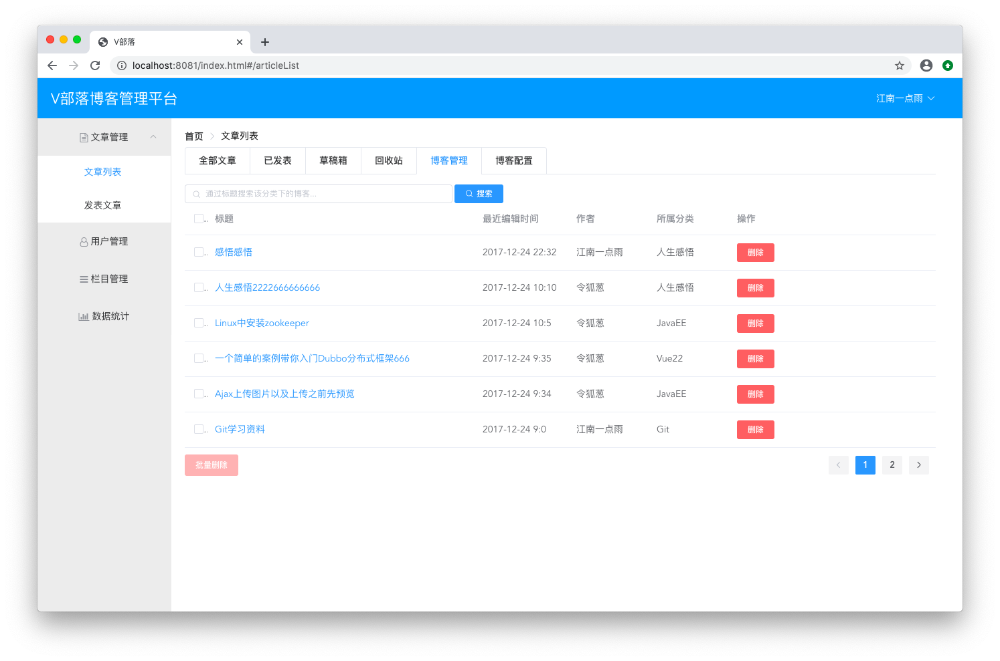

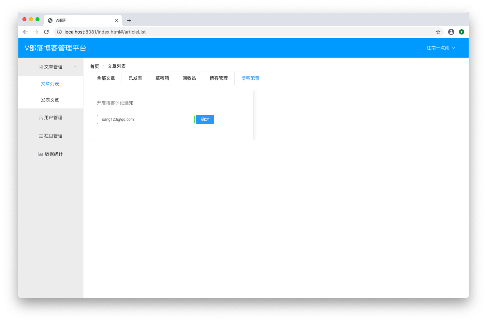

非管理员角色登录
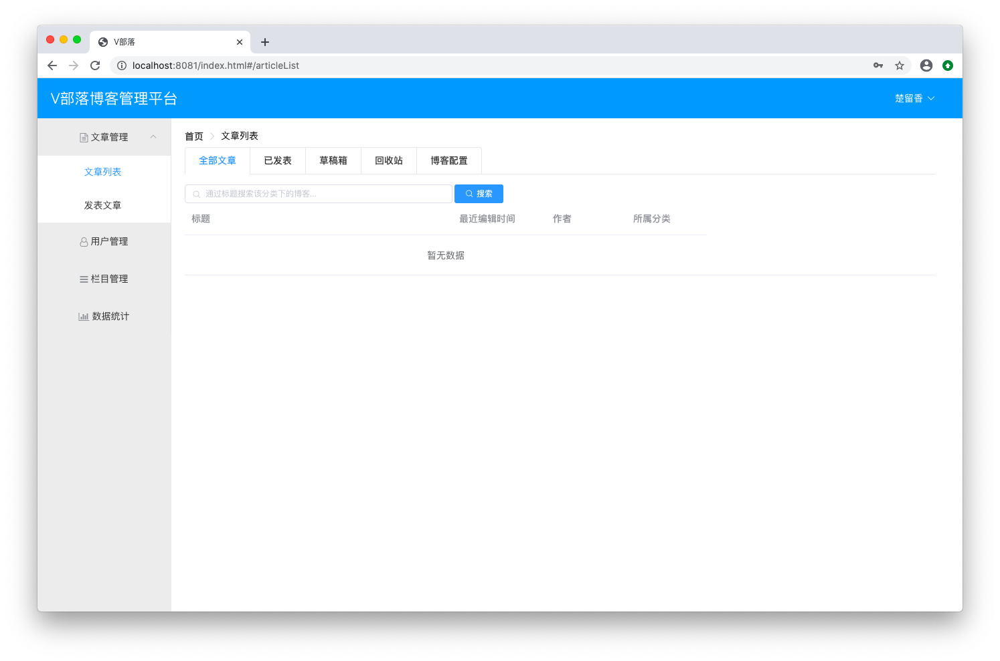

非管理员角色登录，权限不足提示
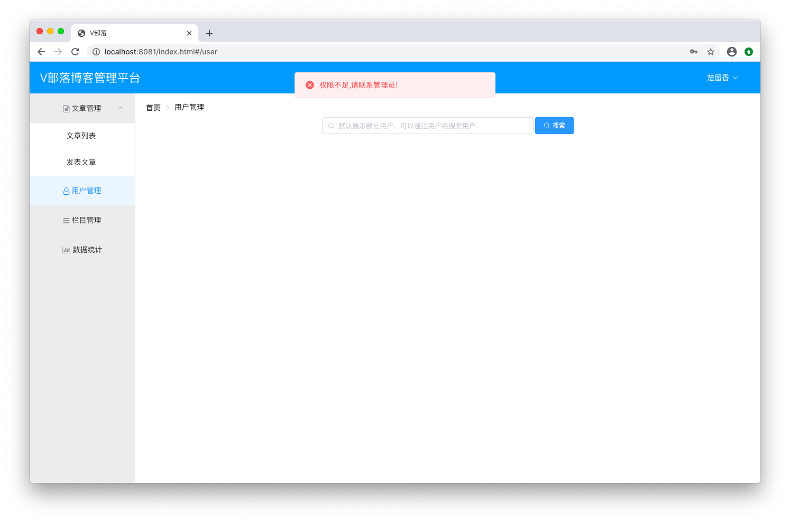

## 数据库设计

### 用户表 user
| 字段 | 类型 | 描述 |
| -- | -- | -- |
| id | int | 用户ID |
| username | varchar | 登录名 |
| nickname | varchar | 昵称 |
| password | varchar | 密码 |
| enabled | tinyint | 是否启用 |
| email | varchar | 邮箱 |
| userface | varchar | 头像 |
| regTime | datetime | 创建日期 |

### 角色表 roles
| 字段 | 类型 | 描述 |
| -- | -- | -- |
| id | int | 角色ID |
| name | varchar | 角色名称 |

### 用户角色表 roles_user
| 字段 | 类型 | 描述 |
| -- | -- | -- |
| id | int | 主键 |
| rid | int | 角色ID |
| uid | int | 用户ID |

### 文章表 article
| 字段 | 类型 | 描述 |
| -- | -- | -- |
| id | int | 文章ID |
| title | varchar | 标题 |
| mdContent | text | md文件源码 |
| htmlContent | text | html源码 |
| summary | text | 摘要 |
| cid | int | 分类ID |
| uid | int | 用户ID |
| publishDate | datetime | 发布时间 |
| editTime | datetime | 编辑时间 |
| state | int | 状态: 0-草稿箱 1-已发表 2-已删除 |
| pageView | int | 浏览量 |

### 分类表 category
| 字段 | 类型 | 描述 |
| -- | -- | -- |
| id | int | 分类ID |
| cateName | varchar | 分类名称 |
| date | date | 创建日期 |

### 标签表 tags
| 字段 | 类型 | 描述 |
| -- | -- | -- |
| id | int | 标签ID |
| tagName | varchar | 标签名称 |

### 文章标签表 article_tags
| 字段 | 类型 | 描述 |
| -- | -- | -- |
| id | int | 主键 |
| aid | varchar | 文章ID |
| tid | int | 标签ID |

### 统计表 pv
| 字段 | 类型 | 描述 |
| -- | -- | -- |
| id | int | 主键 |
| countDate | date | 统计日期 |
| pv | int | pv 值 |
| uid | int | 用户ID |

## 接口设计

### 管理员获取所有文章

| 标题 | 内容 |
| -- | -- |
| URL | /admin/article/all |
| Method | GET |

#### 入参
| 字段 | 类型 | 描述 |
| -- | -- | -- |
| page | Integer | 页数，默认1 |
| count | Integer | 每页条数，默认6 |
| keywords | String | 关键词 |

#### 出参
| 字段 | 类型 | 描述 |
| -- | -- | -- |
| articles | [Article] | 文章列表 |
| totalCount | Integer | 总记录数 |

### 管理员批量删除文章

| 标题 | 内容 |
| -- | -- |
| URL | /admin/article/dustbin |
| Method | PUT |

#### 入参
| 字段 | 类型 | 描述 |
| -- | -- | -- |
| aids | Long[] | 文章ID数组 |
| state | Integer | 文章状态 |

#### 出参
| 字段 | 类型 | 描述 |
| -- | -- | -- |
| status | String | 返回状态 "success", "error" |
| msg | String | 信息 "删除成功!", "删除失败!" |

### 保存文章

| 标题 | 内容 |
| -- | -- |
| URL | /article/ |
| Method | POST |

#### 入参
| 字段 | 类型 | 描述 |
| -- | -- | -- |
| - | Article | 见Article |

#### 出参
| 字段 | 类型 | 描述 |
| -- | -- | -- |
| status | String | 返回状态 "success", "error" |
| msg | String | 信息 "文章ID" "文章保存失败!", "文章发表失败!" |

### 上传图片

| 标题 | 内容 |
| -- | -- |
| URL | /article/uploadimg |
| Method | POST |

#### 入参
| 字段 | 类型 | 描述 |
| -- | -- | -- |
| - | - | 图片 |

#### 出参
| 字段 | 类型 | 描述 |
| -- | -- | -- |
| status | String | 返回状态 "success", "error" |
| msg | String | 信息 "生成的图片URL" "上传失败!" |

### 获取文章列表
| 标题 | 内容 |
| -- | -- |
| URL | /article/all |
| Method | GET |

#### 入参
| 字段 | 类型 | 描述 |
| -- | -- | -- |
| state | Integer | 状态，默认-1 |
| page | Integer | 页数，默认1 |
| count | Integer | 每页条数，默认6 |
| keywords | String | 关键词 |

#### 出参
| 字段 | 类型 | 描述 |
| -- | -- | -- |
| articles | [Article] | 文章列表 |
| totalCount | Integer | 总记录数 |

### 获取文章列表
| 标题 | 内容 |
| -- | -- |
| URL | /article/{aid} |
| Method | GET |

#### 出参
| 字段 | 类型 | 描述 |
| -- | -- | -- |
| - | Article | 见Article |

### 批量删除文章

| 标题 | 内容 |
| -- | -- |
| URL | /article/dustbin |
| Method | PUT |

#### 入参
| 字段 | 类型 | 描述 |
| -- | -- | -- |
| aids | Long[] | 文章ID数组 |
| state | Integer | 文章状态 |

#### 出参
| 字段 | 类型 | 描述 |
| -- | -- | -- |
| status | String | 返回状态 "success", "error" |
| msg | String | 信息 "删除成功!", "删除失败!" |

### 数据统计

| 标题 | 内容 |
| -- | -- |
| URL | /article/dataStatistics |
| Method | GET |

#### 出参
| 字段 | 类型 | 描述 |
| -- | -- | -- |
| categories | List<String> | 日期列表 |
| ds | List<Integer> | 该日阅读量 |

### 管理员获取所有分类

| 标题 | 内容 |
| -- | -- |
| URL | /admin/category/all |
| Method | GET |

#### 出参
| 字段 | 类型 | 描述 |
| -- | -- | -- |
| - | List<Category> | 见Category |

### 管理员添加分类

| 标题 | 内容 |
| -- | -- |
| URL | /admin/category/ |
| Method | POST |

#### 入参
| 字段 | 类型 | 描述 |
| -- | -- | -- |
| - | Category | 见Category |

#### 出参
| 字段 | 类型 | 描述 |
| -- | -- | -- |
| status | String | 返回状态 "success", "error" |
| msg | String | 信息 "添加成功!" "添加失败!", "请输入栏目名称!" |

### 管理员修改分类

| 标题 | 内容 |
| -- | -- |
| URL | /admin/category/ |
| Method | PUT |

#### 入参
| 字段 | 类型 | 描述 |
| -- | -- | -- |
| - | Category | 见Category |

#### 出参
| 字段 | 类型 | 描述 |
| -- | -- | -- |
| status | String | 返回状态 "success", "error" |
| msg | String | 信息 "修改成功!" "修改失败!" |

### 管理员删除分类

| 标题 | 内容 |
| -- | -- |
| URL | /admin/category/{ids} |
| Method | DELETE |

#### 出参
| 字段 | 类型 | 描述 |
| -- | -- | -- |
| status | String | 返回状态 "success", "error" |
| msg | String | 信息 "删除成功!" "删除失败!" |

### 管理员根据昵称获取用户列表

| 标题 | 内容 |
| -- | -- |
| URL | /admin/user |
| Method | GET |

#### 入参
| 字段 | 类型 | 描述 |
| -- | -- | -- |
| nickname | String | 昵称 |

#### 出参
| 字段 | 类型 | 描述 |
| -- | -- | -- |
| - | List<User> | 见User |

### 管理员获取所有用户角色

| 标题 | 内容 |
| -- | -- |
| URL | /admin/roles |
| Method | GET |

#### 出参
| 字段 | 类型 | 描述 |
| -- | -- | -- |
| - | List<Role> | 见Role |

### 管理员启用或禁用用户

| 标题 | 内容 |
| -- | -- |
| URL | /admin/user/enabled |
| Method | PUT |

#### 入参
| 字段 | 类型 | 描述 |
| -- | -- | -- |
| enabled | Boolean | 是否启用 |
| uid | Long | 用户ID |

#### 出参
| 字段 | 类型 | 描述 |
| -- | -- | -- |
| status | String | 返回状态 "success", "error" |
| msg | String | 信息 "更新成功!" "更新失败!" |

### 管理员删除用户

| 标题 | 内容 |
| -- | -- |
| URL | /admin/user/{uid} |
| Method | DELETE |

#### 出参
| 字段 | 类型 | 描述 |
| -- | -- | -- |
| status | String | 返回状态 "success", "error" |
| msg | String | 信息 "删除成功!" "删除失败!" |

### 管理员修改用户角色

| 标题 | 内容 |
| -- | -- |
| URL | /admin/user/role |
| Method | PUT |

#### 入参
| 字段 | 类型 | 描述 |
| -- | -- | -- |
| rids | Long[] | 角色ID列表 |
| id | Long | 用户ID |

#### 出参
| 字段 | 类型 | 描述 |
| -- | -- | -- |
| status | String | 返回状态 "success", "error" |
| msg | String | 信息 "更新成功!" "更新失败!" |

### 获取当前用户昵称

| 标题 | 内容 |
| -- | -- |
| URL | /currentUserName |
| Method | - |

#### 出参
| 字段 | 类型 | 描述 |
| -- | -- | -- |
| - | String | 昵称 |

### 获取当前用户Email

| 标题 | 内容 |
| -- | -- |
| URL | /currentUserEmail |
| Method | - |

#### 出参
| 字段 | 类型 | 描述 |
| -- | -- | -- |
| - | String | 用户邮箱 |

### 当前用户是否是管理员

| 标题 | 内容 |
| -- | -- |
| URL | /isAdmin |
| Method | - |

#### 出参
| 字段 | 类型 | 描述 |
| -- | -- | -- |
| - | Boolean | true: 是管理员 false: 不是管理员 |

### 修改当前用户邮箱

| 标题 | 内容 |
| -- | -- |
| URL | /updateUserEmail |
| Method | PUT |

#### 入参
| 字段 | 类型 | 描述 |
| -- | -- | -- |
| email | String | 邮箱 |

#### 出参
| 字段 | 类型 | 描述 |
| -- | -- | -- |
| status | String | 返回状态 "success", "error" |
| msg | String | 信息 "开启成功!" "开启失败!" |

### 详细入参信息
#### Article
| 字段 | 类型 | 描述 |
| -- | -- | -- |
| id | Long ||
| title | String ||
| mdContent | String ||
| htmlContent | String ||
| summary | String ||
| cid | Long ||
| uid | Long ||
| publishDate | Timestamp ||
| state | Integer ||
| pageView | Integer ||
| editTime | Timestamp ||
| dynamicTags | String[] ||
| nickname | String ||
| cateName | String ||
| tags | List<Tags> ||
| stateStr | String ||

#### Tags
| 字段 | 类型 | 描述 |
| -- | -- | -- |
| id | Long ||
| tagName | String ||

#### Category
| 字段 | 类型 | 描述 |
| -- | -- | -- |
| id | Long ||
| cateName | String ||
| date | Timestamp ||

#### User
| 字段 | 类型 | 描述 |
| -- | -- | -- |
| id | Long ||
| username | String ||
| password | String ||
| nickname | String ||
| enabled | boolean ||
| roles | List<Role> ||
| email | String ||
| userface | String ||
| regTime | Timestamp ||

#### Role
| 字段 | 类型 | 描述 |
| -- | -- | -- |
| id | Long ||
| name | String ||

