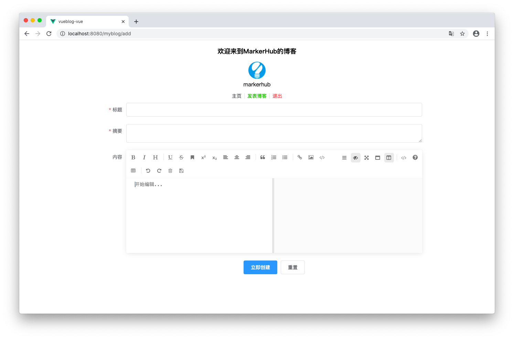

# 练习项目 ⭐️

前端内容在资源包中，安装node环境
```bash
cd myblog
npm install
node main.js
```
http://localhost:8080/

## 界面预览





服务端要求
+ 端口号 8081
+ 自行设计数据库表 (提示：两张表就行了，一张用户表一张文章表)

## 接口设计

### 登录
+ 用户数据可以手动添加到表中，注意数据库中存储的密码需要加密
+ 根据用户名密码进行登录验证
+ 用户不存在或密码不正确需要给出消息提示
+ 可以尝试使用 Security Shiro Jwt 等进行安全验证，不作要求

| 标题 | 内容 |
| -- | -- |
| URL | /login |
| Method | POST |

#### 入参
| 字段 | 类型 | 描述 |
| -- | -- | -- |
| username | String | 用户名 |
| password | String | 密码 |

```
{
    "username": "markerhub",
    "password": "111111"
}
```

#### 出参
| 字段 | 类型 | 描述 |
| -- | -- | -- |
| code | Integer | 返回值 |
| msg | String | 消息 |
| data | Object |  |
| data.id | Integer | 用户ID |
| data.avatar | String | 用户头像 |
| data.email | String | 用户邮箱 |
| data.username | String | 登录名 |

```
{
    "code": 200,
    "msg": "操作成功",
    "data":{
        "id": 1,
        "avatar": "https://image-1300566513.cos.ap-guangzhou.myqcloud.com/upload/images/5a9f48118166308daba8b6da7e466aab.jpg",
        "email": null,
        "username": "markerhub"
    }
}
```
```
{
    "code": 400,
    "msg": "密码不正确" // "用户不存在"
}
```

### 登出
| 标题 | 内容 |
| -- | -- |
| URL | /logout |
| Method | GET |

#### 出参
| 字段 | 类型 | 描述 |
| -- | -- | -- |
| code | Integer | 返回值 |
| msg | String | 消息 |

```
{
    "code": 200,
    "msg": "操作成功",
}
```

### 获取文章列表
+ 根据页号和每页条数获取文章列表

| 标题 | 内容 |
| -- | -- |
| URL | /blogs |
| Method | GET |

#### 入参
| 字段 | 类型 | 描述 |
| -- | -- | -- |
| currentPage | Integer | 页号，默认值 1 |
| pageCount | Integer | 每页条数，默认值 5 |

#### 出参
| 字段 | 类型 | 描述 |
| -- | -- | -- |
| code | Integer | 返回值 |
| msg | String | 消息 |
| data | Object |  |
| data.total | Integer | 总记录数 |
| data.size | Integer | 每页条数 |
| data.current | Integer | 当前页号 |
| data.records | [Object] | 文章列表 |
| data.records[].id | Integer | 文章ID |
| data.records[].userId | Integer | 作者ID |
| data.records[].title | String | 文章标题 |
| data.records[].description | String | 文章摘要 |
| data.records[].content | String | 文章内容 |
| data.records[].created | String | 创建日期 |
| data.records[].status | Integer | 状态 |

```
{
    "code": 200,
    "msg": "操作成功",
    "data": {
        "records": [{
            "id": 3,
            "userId": 1,
            "title": "公众号MarkerHub文章索引","description": "xxxxxxx",
            "content": "zzzzzzzzzzzzzzzzz",
            "created": "2020-05-28",
            "status": 0
        }],
        "total": 6,
        "size": 5,
        "current": 1
    }
}
```

### 根据文章ID获取文章内容
+ 根据文章ID获取文章内容，如果没有获取到则返回该博客已被删除的错误提示。

| 标题 | 内容 |
| -- | -- |
| URL | /blog/{id} |
| Method | GET |

#### 出参
| 字段 | 类型 | 描述 |
| -- | -- | -- |
| code | Integer | 返回值 |
| msg | String | 消息 |
| data | Object |  |
| data.id | Integer | 文章ID |
| data.userId | Integer | 作者ID |
| data.title | String | 文章标题 |
| data.description | String | 文章摘要 |
| data.content | String | 文章内容 |
| data.created | String | 创建日期 |
| data.status | Integer | 状态 |

```
{
    "code": 200,
    "msg": "操作成功",
    "data": {
        "id": 3,
        "userId": 1,
        "title": "公众号MarkerHub文章索引",
        "description": "xxxxxxxxxxx",
        "content": "zzzzzzzzzzzzzzzzz",
        "created": "2020-05-28",
        "status": 0
    }
}
```
```
{
    "code": 400,
    "msg": "该博客已被删除"
}
```

### 新建或修改文章
+ 新建的场合只需传 title description content 并且都不能为空
+ 修改的场合还需要传文章ID
+ 如果做权限验证，可以加验证，仅登录用户可以新建文章，仅自己可以编辑自己的文章

| 标题 | 内容 |
| -- | -- |
| URL | /blog/edit |
| Method | POST |

#### 入参
| 字段 | 类型 | 描述 |
| -- | -- | -- |
| id | Integer | 文章ID，新建文章没有ID可以为空 |
| title | String | 文章标题 |
| description | String | 文章摘要 |
| content | String | 文章内容 |

```
{
    "id": 3,
    "title": "公众号MarkerHub文章索引",
    "description": "xxxxxxxxxxx",
    "content": "zzzzzzzzzzzzzzzzz"
}
```

#### 出参
| 字段 | 类型 | 描述 |
| -- | -- | -- |
| code | Integer | 返回值 |
| msg | String | 消息 |

```
{
    "code": 200,
    "msg": "操作成功",
}
```
