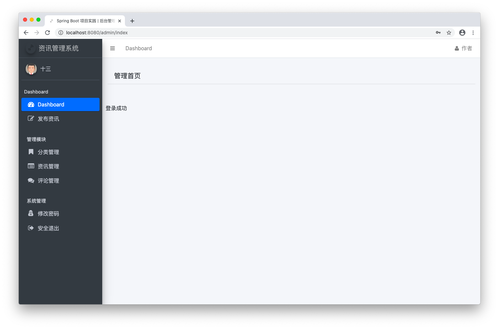

# 练习项目 ⭐️⭐️⭐️

前端资源在资源包中，解压到项目 `src/main/resources` 路径下，使用了 thymeleaf

## 界面预览





## 数据库设计
+ 用户表
+ 文章表
+ 分类表
+ 评论表

## 接口设计

### 获取验证码
+ 参考资料 `com.github.penggle.kaptcha` 实现验证码获取
+ 接口会直接返回图片并在Session中保存验证码内容

| 标题 | 内容 |
| -- | -- |
| URL | /common/kaptcha |
| Method | GET |

### 导航到登录页面
+ 这是直接导航到页面，并非接口

| 标题 | 内容 |
| -- | -- |
| URL | /admin/login |
| Method | GET |

返回 "admin/login" 页面

### 导航到管理首页
+ 这是直接导航到页面，并非接口

| 标题 | 内容 |
| -- | -- |
| URL | "/admin", "/admin/", "/admin/index", "/admin/index.html" |
| Method | GET |

返回 "admin/index" 页面

### 登录验证
+ 这是直接导航到页面，并非接口
+ 在 session 里添加 `loginUserId` 表示用户ID, `loginUser` 表示用户昵称

| 标题 | 内容 |
| -- | -- |
| URL | /admin/login |
| Method | POST |

#### 入参
| 字段 | 类型 | 描述 |
| -- | -- | -- |
| userName | String | 登录名 |
| password | String | 密码 |
| verifyCode | String | 验证码 |

验证失败返回 "admin/login" 页面
验证成功返回 "redirect:/admin/index" 页面

### 退出登录
+ 这是直接导航到页面，并非接口
+ 从 session 里清除 `loginUserId` `loginUser` `errorMsg`

| 标题 | 内容 |
| -- | -- |
| URL | /admin/logout |
| Method | GET |

返回 "admin/login" 页面

### 导航到修改密码页面
+ 这是直接导航到页面，并非接口
+ request.setAttribute("loginUserName", 登录名);
+ request.setAttribute("nickName", 昵称);

| 标题 | 内容 |
| -- | -- |
| URL | /admin/profile |
| Method | GET |

返回 "admin/profile" 页面

### 修改密码
+ 从 session 里清除 `loginUserId` `loginUser` `errorMsg`

| 标题 | 内容 |
| -- | -- |
| URL | /admin/profile/password |
| Method | POST |

#### 入参
| 字段 | 类型 | 描述 |
| -- | -- | -- |
| originalPassword | String | 原密码 |
| newPassword | String | 新密码 |

#### 出参
```
"success"
```
```
"修改失败"
```

### 修改用户登录名和昵称

| 标题 | 内容 |
| -- | -- |
| URL | /admin/profile/name |
| Method | POST |

#### 入参
| 字段 | 类型 | 描述 |
| -- | -- | -- |
| loginUserName | String | 登录名 |
| nickName | String | 昵称 |

#### 出参
```
"success"
```
```
"修改失败"
```

### 导航到分类管理页面
+ 这是直接导航到页面，并非接口

| 标题 | 内容 |
| -- | -- |
| URL | /admin/categories |
| Method | GET |

返回 "admin/category" 页面

### 获取分类列表接口

| 标题 | 内容 |
| -- | -- |
| URL | /admin/categories/list |
| Method | GET |

#### 入参
| 字段 | 类型 | 描述 |
| -- | -- | -- |
| page | Integer | 页号，默认值 1 |
| limit | Integer | 每页条数，默认值 10 |

#### 出参
| 字段 | 类型 | 描述 |
| -- | -- | -- |
| resultCode | Integer | 返回值 |
| message | String | 消息 |
| data | Object |  |
| data.totalCount | Integer | 总条数 |
| data.pageSize | Integer | 每页条数 |
| data.totalPage | Integer | 总页数 |
| data.currPage | Integer | 当前页数 |
| data.list[].categoryId | Integer | 分类ID |
| data.list[].categoryName | String | 分类名称 |
| data.list[].isDeleted | Integer | 是否已删除 |
| data.list[].createTime | String | 创建日期 |

```
{
    "resultCode": 200,
    "message": "SUCCESS",
    "data": {
        "totalCount": 7,
        "pageSize": 10,
        "totalPage":1, 
        "currPage":1, 
        "list": [
            {"categoryId":11,"categoryName":"文化","isDeleted":0,"createTime":"2019-02-12 15:28:38"},{"categoryId":10,"categoryName":"教育","isDeleted":0,"createTime":"2019-02-12 15:28:29"},{"categoryId":9,"categoryName":"IT资讯","isDeleted":0,"createTime":"2019-02-12 15:28:15"},{"categoryId":8,"categoryName":"军事","isDeleted":0,"createTime":"2019-02-12 15:22:41"},{"categoryId":7,"categoryName":"视频","isDeleted":0,"createTime":"2019-02-12 15:00:13"},{"categoryId":2,"categoryName":"图片","isDeleted":0,"createTime":"2019-02-03 11:53:22"},{"categoryId":1,"categoryName":"体育","isDeleted":0,"createTime":"2019-02-03 11:51:24"}
        ]
    }
}
```

### 根据ID获取分类详情接口

| 标题 | 内容 |
| -- | -- |
| URL | /admin/categories/info/{id} |
| Method | GET |

#### 出参
| 字段 | 类型 | 描述 |
| -- | -- | -- |
| resultCode | Integer | 返回值 |
| message | String | 消息 |
| data | Object |  |
| data.categoryId | Integer | 分类ID |
| data.categoryName | String | 分类名称 |
| data.isDeleted | Integer | 是否已删除 |
| data.createTime | String | 创建日期 |

```
{
    "resultCode": 200,
    "message": "SUCCESS",
    "data": {
        "categoryId": 11,
        "categoryName": "文化",
        "isDeleted": 0,
        "createTime": "2019-02-12 15:28:38"
    }
}
```

### 添加分类
+ 通过名称添加，需要检查输入的名称是否存在
+ 对已存在的添加请求需要返回错误信息

| 标题 | 内容 |
| -- | -- |
| URL | /admin/categories/save |
| Method | POST |

#### 入参
| 字段 | 类型 | 描述 |
| -- | -- | -- |
| categoryName | String | 分类名称 |

#### 出参
| 字段 | 类型 | 描述 |
| -- | -- | -- |
| resultCode | Integer | 返回值 |
| message | String | 消息 |

```
{
    "resultCode": 200,
    "message": "SUCCESS"
}
```
```
{
    "resultCode": 500,
    "message": "分类名称重复"
}
```

### 修改分类
+ 通过ID和名称修改，需要检查输入的名称是否存在
+ 对已存在的修改请求需要返回错误信息

| 标题 | 内容 |
| -- | -- |
| URL | /admin/categories/update |
| Method | POST |

#### 入参
| 字段 | 类型 | 描述 |
| -- | -- | -- |
| categoryId | Integer | 分类ID |
| categoryName | String | 分类名称 |

#### 出参
| 字段 | 类型 | 描述 |
| -- | -- | -- |
| resultCode | Integer | 返回值 |
| message | String | 消息 |

```
{
    "resultCode": 200,
    "message": "SUCCESS"
}
```
```
{
    "resultCode": 500,
    "message": "分类名称重复"
}
```

### 删除分类
+ 支持批量删除

| 标题 | 内容 |
| -- | -- |
| URL | /admin/categories/delete |
| Method | POST |

#### 入参
| 字段 | 类型 | 描述 |
| -- | -- | -- |
| ids | Integer[] | 分类ID数组 |

#### 出参
| 字段 | 类型 | 描述 |
| -- | -- | -- |
| resultCode | Integer | 返回值 |
| message | String | 消息 |

```
{
    "resultCode": 200,
    "message": "SUCCESS"
}
```
```
{
    "resultCode": 500,
    "message": "删除失败"
}
```

### 导航到评论管理页面
+ 这是直接导航到页面，并非接口

| 标题 | 内容 |
| -- | -- |
| URL | /admin/comments |
| Method | GET |

返回 "admin/comment" 页面

### 获取分类列表接口

| 标题 | 内容 |
| -- | -- |
| URL | /admin/comments/list |
| Method | GET |

#### 入参
| 字段 | 类型 | 描述 |
| -- | -- | -- |
| page | Integer | 页号，默认值 1 |
| limit | Integer | 每页条数，默认值 10 |

#### 出参
| 字段 | 类型 | 描述 |
| -- | -- | -- |
| resultCode | Integer | 返回值 |
| message | String | 消息 |
| data | Object |  |
| data.totalCount | Integer | 总条数 |
| data.pageSize | Integer | 每页条数 |
| data.totalPage | Integer | 总页数 |
| data.currPage | Integer | 当前页数 |
| data.list[].commentId | Integer | 评论ID |
| data.list[].newsId | String | 资讯ID |
| data.list[].commentator | String | 评论者 |
| data.list[].commentBody | String | 评论内容 |
| data.list[].commentStatus | String | 评论状态 0-待审核 1-已审核 |
| data.list[].isDeleted | Integer | 是否已删除 |
| data.list[].createTime | String | 创建日期 |

```
{
    "resultCode": 200,
    "message": "SUCCESS",
    "data": {
        "totalCount": 3,
        "pageSize": 10,
        "totalPage": 1,
        "currPage": 1,
        "list": [
            {
                "commentId":3,
                "newsId":1,
                "commentator":"fads",
                "commentBody":"留言测试",
                "commentStatus":0,
                "isDeleted":0,
                "createTime":"2019-02-04 04:35:42"
            },
            {
                "commentId":2,
                "newsId":2,
                "commentator":"sdfds",
                "commentBody":"评论测试",
                "commentStatus":0,
                "isDeleted":0,
                "createTime":"2019-02-03 12:34:30"
            },
            {
                "commentId":1,
                "newsId":1,
                "commentator":"13",
                "commentBody":"fads",
                "commentStatus":1,
                "isDeleted":0,
                "createTime":"2019-02-03 12:29:33"
            }
        ]
    }
}
```

### 审核评论
+ 支持批量

| 标题 | 内容 |
| -- | -- |
| URL | /admin/comments/checkDone |
| Method | POST |

#### 入参
| 字段 | 类型 | 描述 |
| -- | -- | -- |
| ids | Integer[] | 评论ID数组 |

#### 出参
| 字段 | 类型 | 描述 |
| -- | -- | -- |
| resultCode | Integer | 返回值 |
| message | String | 消息 |

```
{
    "resultCode": 200,
    "message": "SUCCESS"
}
```
```
{
    "resultCode": 500,
    "message": "审核失败"
}
```

### 删除评论
+ 支持批量删除

| 标题 | 内容 |
| -- | -- |
| URL | /admin/comments/delete |
| Method | POST |

#### 入参
| 字段 | 类型 | 描述 |
| -- | -- | -- |
| ids | Integer[] | 分类ID数组 |

#### 出参
| 字段 | 类型 | 描述 |
| -- | -- | -- |
| resultCode | Integer | 返回值 |
| message | String | 消息 |

```
{
    "resultCode": 200,
    "message": "SUCCESS"
}
```
```
{
    "resultCode": 500,
    "message": "删除失败"
}
```

### 导航到资讯管理页面
+ 这是直接导航到页面，并非接口

| 标题 | 内容 |
| -- | -- |
| URL | /admin/news |
| Method | GET |

返回 "admin/news" 页面

### 导航到资讯发布编辑页面
+ 这是直接导航到页面，并非接口
+ request.setAttribute("categories", 分类列表);
+ 分类列表: [{categoryId: 1, categoryName: "name", "isDeleted": 0, "createTime": "2020-09-01 10:00:00"}]

| 标题 | 内容 |
| -- | -- |
| URL | /admin/news/edit |
| Method | GET |

返回 "admin/edit" 页面

### 导航到资讯发布编辑页面
+ 这是直接导航到页面，并非接口
+ request.setAttribute("news", 资讯内容);
+ 资讯内容: {newsId, newsTitle, newsCategoryId, newsCoverImage, newsContent, newsStatus, newsViews, isDeleted, createTime, updateTime}
+ request.setAttribute("categories", 分类列表);
+ 分类列表: [{categoryId, categoryName, isDeleted, createTime}]

| 标题 | 内容 |
| -- | -- |
| URL | /admin/news/edit/{newsId} |
| Method | GET |

返回 "admin/edit" 页面

### 获取资讯列表
| 标题 | 内容 |
| -- | -- |
| URL | /admin/news/list |
| Method | GET |

#### 入参
| 字段 | 类型 | 描述 |
| -- | -- | -- |
| page | Integer | 页号，默认值 1 |
| limit | Integer | 每页条数，默认值 10 |

#### 出参
| 字段 | 类型 | 描述 |
| -- | -- | -- |
| resultCode | Integer | 返回值 |
| message | String | 消息 |
| data | Object |  |
| data.totalCount | Integer | 总条数 |
| data.pageSize | Integer | 每页条数 |
| data.totalPage | Integer | 总页数 |
| data.currPage | Integer | 当前页数 |
| data.list[].newsId | Integer | 资讯ID |
| data.list[].newsTitle | String | 资讯标题 |
| data.list[].newsCategoryId | String | 分类ID |
| data.list[].newsCoverImage | String | 封面地址 |
| data.list[].newsContent | String | 资讯正文 |
| data.list[].newsStatus | String | 资讯状态 0-草稿 1-已发布 |
| data.list[].newsViews | String | 浏览量 |
| data.list[].isDeleted | Integer | 是否已删除 |
| data.list[].createTime | String | 创建日期 |
| data.list[].createTime | String | 修改日期 |

```
{
    "resultCode": 200,
    "message": "SUCCESS",
    "data": {
        "totalCount": 2,
        "pageSize": 10,
        "totalPage": 1,
        "currPage": 1,
        "list": [
            {
                "newsId":8,
                "newsTitle":"d",
                "newsCategoryId":11,
                "newsCoverImage":"http://localhost:8080/files/20200708_16192293.jpg",
                "newsContent":"dddd",
                "newsStatus":0,
                "newsViews":0,
                "isDeleted":0,
                "createTime":"2020-07-09 05:19:23",
                "updateTime":"2020-07-08T21:19:23.000+00:00"
            },{
                "newsId":7,
                "newsTitle":"e",
                "newsCategoryId":11,
                "newsCoverImage":"http://localhost:8080/files/20200708_16082370.jpg",
                "newsContent":"",
                "newsStatus":1,
                "newsViews":0,
                "isDeleted":0,
                "createTime":"2020-07-09 05:08:24",
                "updateTime":"2020-07-08T21:08:24.000+00:00"
            }
        ]
    }
}
```

### 保存资讯

| 标题 | 内容 |
| -- | -- |
| URL | /admin/news/save |
| Method | POST |

#### 入参
| 字段 | 类型 | 描述 |
| -- | -- | -- |
| newsTitle | String | 资讯标题 |
| newsCategoryId | Integer | 分类ID |
| newsContent | String | 资讯内容 |
| newsCoverImage | String | 封面地址 |
| newsStatus | Integer | 资讯状态 0-草稿 1-已发布 |

#### 出参
| 字段 | 类型 | 描述 |
| -- | -- | -- |
| resultCode | Integer | 返回值 |
| message | String | 消息 |

```
{
    "resultCode": 200,
    "message": "添加成功"
}
```
```
{
    "resultCode": 500,
    "message": "" // 其它相关错误提示
}
```

### 修改资讯

| 标题 | 内容 |
| -- | -- |
| URL | /admin/news/update |
| Method | POST |

#### 入参
| 字段 | 类型 | 描述 |
| -- | -- | -- |
| newsId | Integer | 资讯ID |
| newsTitle | String | 资讯标题 |
| newsCategoryId | Integer | 分类ID |
| newsContent | String | 资讯内容 |
| newsCoverImage | String | 封面地址 |
| newsStatus | Integer | 资讯状态 0-草稿 1-已发布 |

#### 出参
| 字段 | 类型 | 描述 |
| -- | -- | -- |
| resultCode | Integer | 返回值 |
| message | String | 消息 |

```
{
    "resultCode": 200,
    "message": "修改成功"
}
```
```
{
    "resultCode": 500,
    "message": "" // 其它相关错误提示
}
```

### 删除资讯

| 标题 | 内容 |
| -- | -- |
| URL | /admin/news/delete |
| Method | POST |

#### 入参
| 字段 | 类型 | 描述 |
| -- | -- | -- |
| ids | Integer[] | 分类ID数组 |

#### 出参
| 字段 | 类型 | 描述 |
| -- | -- | -- |
| resultCode | Integer | 返回值 |
| message | String | 消息 |

```
{
    "resultCode": 200,
    "message": "SUCCESS"
}
```
```
{
    "resultCode": 500,
    "message": "删除失败"
}
```

### 上传文件

| 标题 | 内容 |
| -- | -- |
| URL | /admin/upload/file |
| Method | POST |

#### 入参
| 字段 | 类型 | 描述 |
| -- | -- | -- |
| file | File | 待上传文件 |

#### 出参
| 字段 | 类型 | 描述 |
| -- | -- | -- |
| resultCode | Integer | 返回值 |
| message | String | 消息 |
| data | String | 文件路径 |

```
{
    "resultCode": 200,
    "message": "SUCCESS",
    "data": "/files/20200708_16094715.jpg"
}
```

### 导航到资讯详情页
+ 这是直接导航到页面，并非接口
+ request.setAttribute("newsDetail", 资讯内容);
+ 资讯内容: {newsId, newsTitle, newsCategoryId, newsCoverImage, newsContent, newsStatus, newsViews, isDeleted, createTime, updateTime}

| 标题 | 内容 |
| -- | -- |
| URL | /news/{newsId} |
| Method | GET |

返回 "index/detail" 页面

### 提交评论

| 标题 | 内容 |
| -- | -- |
| URL | /news/comment |
| Method | POST |

#### 入参
| 字段 | 类型 | 描述 |
| -- | -- | -- |
| newsId | Integer | 资讯ID |
| verifyCode | String | 验证码 |
| commentator | String | 评论者 |
| commentBody | String | 评论内容 |

#### 出参
| 字段 | 类型 | 描述 |
| -- | -- | -- |
| resultCode | Integer | 返回值 |
| message | String | 消息 |
| data | Boolean | 状态 |

```
{
    "resultCode": 200,
    "message": "SUCCESS",
    "data": true
}
```
